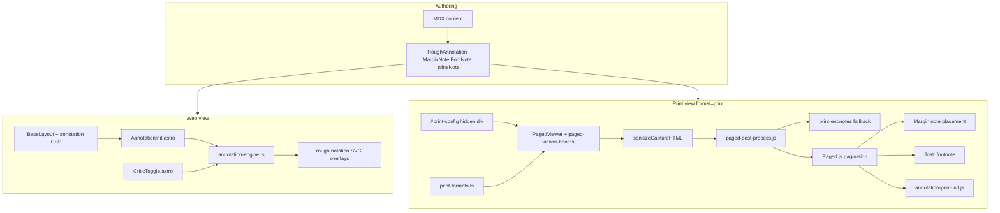

# Annotation System (v2.1)

> **Status:** Implemented in findcongwang-astro (June 2026)  
> **Supersedes:** v2 (fixed `@page` size) and legacy `data-rough*` / `RoughNotationHighlight.astro`  
> **Related:** [`plans/dynamic-print-format-system.md`](../plans/dynamic-print-format-system.md) (implementation spec), [`plans/annotation-system-extraction.md`](../plans/annotation-system-extraction.md) (future package split)

**v2.1** adds the **dynamic print format system** on top of the v2 annotation pipeline: per-document page presets, format-aware margin notes vs endnotes, spread preview, and optional per-page print CSS.

## Purpose

The annotation system lets MDX authors layer **semantic meaning** on prose without breaking reading flow:

- **Rough marks** (highlights, boxes, brackets) for emphasis and structure
- **Margin notes** for citations and side commentary (print: right margin)
- **Footnotes** for definitions and digressions (print: page bottom via Paged.js)
- **Inline notes** (ruby/furigana) for density without footnote hops
- **Critic layer** for editorial markup hidden by default (Chief Editor, Academic Critic lenses)

Web and print share the same MDX components. Rendering diverges at runtime: hover tooltips and animated SVG overlays on web; Paged.js layout, margin placement, and static roughNotation on print.

## Architecture



### Web pipeline

1. `BaseLayout.astro` loads `annotation-colours.css`, `annotation-brand.css`, and mounts `AnnotationInit.astro`.
2. On `DOMContentLoaded`, `AnnotationInit` calls `initRoughAnnotations({ animate: true, respectCriticToggle: true })` unless `?format=print` or `?format=slides` (avoids baking SVGs into print capture).
3. `annotation-engine.ts` finds `[data-rough-annotation]`, resolves colours, calls `rough-notation` `annotate()`, registers instances in `window.__annotationRegistry`.
4. `CriticToggle.astro` (on content pages via `ContentLayout`) persists preferences in `localStorage` and dispatches `annotation:preferences-changed`. The engine toggles **SVG overlay visibility only**; wrapped text always stays visible.

### Print pipeline

1. `ContentLayout` (or page-specific layouts like `curriculum-vitae.astro`) wraps article body in `#paged-content`, emits hidden `#print-config`, and mounts `PagedViewer` **after** `#paged-content` (prevents script re-entry on capture).
2. `PagedViewer` delegates to `paged-viewer-boot.ts`, which reads `#print-config` and URL overrides (`&size=`, `&mode=`, `&spread=`), resolves format via `src/data/print-formats.ts`, injects literal `@page` rules (Paged.js does not support `var()` in `@page`), loads Google Fonts + `print-formats.css` + `paged-book.css` + optional extra stylesheets, and `document.write()` a clean print document. Capture runs synchronously when no Mermaid blocks are present (deferring breaks `document.write` in some browsers).
3. `sanitizeCaptureHTML()` strips `<script>` tags, removes orphan `svg.rough-annotation`, and clears `data-rough-annotated` before capture.
4. `paged-post-process.js` transforms margin notes and footnotes, optionally appends a `.print-endnotes` section when the active preset has no margin column, runs `Paged.Previewer().preview()`, then:
   - **Margin notes:** absolute placement in the right margin (only when `hasMarginNotes`); geometry from `window.__printFormatConfig`
   - **Endnote fallback:** when format disables margin notes, note bodies render in a trailing Notes section instead
   - **Footnotes:** Paged.js native `float: footnote` (see Footnotes below)
   - **Rough marks:** `initPrintRoughAnnotations()` post-pagination (no animation)
5. Optional `?critic=1` includes critic-layer DOM; default print strips `[data-critic="true"]`.

### Print format selection

Format presets live in `src/data/print-formats.ts`. Default is `square-8.5x9` (backward compatible with the original layout).

| Frontmatter | Purpose |
|-------------|---------|
| `print_format` | Preset key (e.g. `portrait-6x9`, `portrait-letter`) |
| `print_mode` | `physical` (single size) or `digital` (per-section overrides) |
| `print_spread_start` | `odd` (page 1 alone, then pairs) or `even` (pairs from page 1) |
| `print_annotations` | Force margin notes on/off; auto-detect from content if omitted |

URL overrides for testing: `?format=print&size=portrait-6x9`, `?format=print&mode=digital`, `?format=print&spread=even`.

**Spread preview:** On viewports wide enough for two pages, portrait/square formats show at most two pages per row. `print_spread_start: odd` (default) leaves page 1 alone before pairing; `even` pairs from page 1. Landscape, wide, and digital modes always use single-page preview.

**Digital mode:** wrap sections in `<PrintSection format="wide-12x9">` or use `<PageBreak format="landscape-10x7" />`. PagedViewer scans `data-print-section-format` and injects named `@page print-{key}` rules.

Only `square-8.5x9` enables margin-note placement. Other presets convert margin notes to endnotes at the document end.

### `#print-config` bridge

Build-time layouts emit a hidden config element read by `paged-viewer-boot.ts` before capture:

```html
<div id="print-config" class="hidden"
  data-print-format="square-8.5x9"
  data-print-mode="physical"
  data-print-spread-start="odd"
  data-print-annotations="true"
  data-print-body-class="paged-mode"
  data-print-stylesheets="/styles/my-page-print.css"
></div>
```

| Attribute | Source | Purpose |
|-----------|--------|---------|
| `data-print-format` | Frontmatter `print_format` or page default | Preset key from `print-formats.ts` |
| `data-print-mode` | Frontmatter `print_mode` | `physical` or `digital` |
| `data-print-spread-start` | Frontmatter `print_spread_start` | Spread preview pairing (`odd` / `even`) |
| `data-print-annotations` | Frontmatter `print_annotations` | Force margin notes on/off; omit to auto-detect |
| `data-print-body-class` | Page override | Extra body classes (e.g. `paged-mode print-cv`) |
| `data-print-stylesheets` | Page override | Comma-separated CSS paths loaded after `paged-book.css` |

**Curriculum Vitae example:** `portrait-letter` format, `print-cv` body class, `/styles/curriculum-vitae-print.css` for grid tables, domain colours, and typography (Tailwind is not available in the print document).

Content collection frontmatter fields are defined in `src/content/config.ts` (`print_format`, `print_mode`, `print_annotations`, `print_spread_start`).

## Component interfaces

### `RoughAnnotation.astro`

Visual rough-notation wrapper. Renders a `span` or `div` (block types only) with data attributes for the engine.

| Prop | Type | Default | Description |
|------|------|---------|-------------|
| `type` | `"highlight" \| "box" \| "circle" \| "underline" \| "bracket" \| "strikethrough" \| "crossed-off"` | `"highlight"` | rough-notation shape |
| `color` | `string` | `"green"` | Semantic or brand colour key |
| `palette` | `"semantic" \| "brand"` | `"semantic"` | Which CSS token set to use |
| `customColor` | `string` | — | Explicit hex/oklch; bypasses tokens |
| `critic` | `boolean` | `false` | Critic-layer mark; hidden unless critic toggle on |
| `lens` | `"chief-editor" \| "academic-critic"` | — | Sub-filter when critic layer enabled |
| `marginRef` | `number` | — | Sync stroke colour from margin note `[n]` |
| `brackets` | `string` | `"left"` | Comma-separated sides for `type="bracket"` |
| `class` | `string` | — | Additional Tailwind/classes |

**DOM contract:**

```html
<span
  class="rough-annotation"
  data-rough-annotation
  data-type="highlight"
  data-palette="semantic"
  data-color="green"
  data-critic="true"
  data-lens="chief-editor"
  data-margin-ref="5"
  style="--annotation-stroke: var(...); --annotation-highlight: var(...);"
>...</span>
```

**Rules:**

- `palette="brand"` sets `data-brand-mark="true"`. Brand marks **ignore** the master content toggle (always visible).
- `color="red"` without `critic={true}` logs a dev warning (red is critic-exclusive in author mode).
- Prefer `highlight` or `underline` for multi-line text; `box`/`circle` warn in dev when wrapping multiple lines.

### `MarginNote.astro`

Dotted underline + `[n]` badge on web; hover tooltip with optional label. Print: ref span in body + note block in right margin.

| Prop | Type | Default | Description |
|------|------|---------|-------------|
| `n` | `number \| string` | — | Note index (required for cross-ref) |
| `note` | `string` | — | Margin body text |
| `label` | `string` | — | Short heading in tooltip/margin |
| `color` | `SemanticColour` | — | Semantic colour; omit for positional palette by `n` |
| `critic` | `boolean` | `false` | Critic margin note |
| `lens` | `CriticLens` | — | Lens filter |

Wraps slot content (the phrase underlined in prose).

### `FootNote.astro`

Dual-render: web hover + print anchor. Web shows `.footnote-web` only; print shows `.footnote-anchor` only (via CSS).

| Prop | Type | Default | Description |
|------|------|---------|-------------|
| `n` | `number \| string` | — | Footnote number |
| `note` | `string` | — | Footnote body |
| `color` | `SemanticColour` | — | Superscript colour (default accent) |

Slot = inline term (e.g. `Perceptiosphere`).

### `InlineNote.astro`

Ruby-style reading above base text (furigana pattern).

| Prop | Type | Default | Description |
|------|------|---------|-------------|
| `reading` | `string` | — | Text in `<rt>` above slot |
| `color` | `SemanticColour \| string` | — | `#hex` or semantic token |

Slot = base word. Global CSS bumps `line-height` on paragraphs containing `ruby.inline-note`.

### `AnnotationPanel.astro`

Dynamic annotation legend and controls panel (replaces former CriticToggle). Fixed-position panel that scans the page DOM at runtime, discovers which annotation types and colours exist, and renders a grouped legend with per-item toggle controls.

**Features:**
- Two groups: Author annotations, Critic annotations (Critic hidden if no `[data-critic]` content)
- Per-colour/type legend items with swatch, label from global `COLOUR_LEGEND`, count, and individual toggle
- Margin notes, footnotes, and inline notes each get their own toggle
- Critic lenses shown as sub-groups with their own annotation items
- Collapsible to icon (remembers state in localStorage)
- Mobile-first: starts collapsed on viewports < 768px, expanded on desktop
- Web only; panel is `position: fixed` and outside `#paged-content`

**Global Colour Legend (`COLOUR_LEGEND` in `annotation-colours.ts`):**

| Colour | Author meaning | Critic meaning |
|--------|---------------|----------------|
| Green | Key insight | Approved |
| Amber | Needs research | Needs revision |
| Blue | Citation / source | Reference |
| Red | (unused) | Deletion / issue |
| Purple | Connection | Suggestion |
| Teal | Definition / term | Definition |
| Burgundy | Brand accent | (unused) |

**localStorage keys:**

| Key | Default |
|-----|---------|
| `annotation-master` | `true` |
| `annotation-critic` | `false` |
| `annotation-lens-chief-editor` | `true` |
| `annotation-lens-academic-critic` | `true` |
| `annotation-margin-notes` | `true` |
| `annotation-footnotes` | `true` |
| `annotation-inline-notes` | `true` |
| `annotation-panel-collapsed` | `true` (mobile) / `false` (desktop) |
| `annotation-author-{color}-{type}` | `true` |
| `annotation-critic-{color}-{type}` | `true` |

### Structural (print layout)

| Component | Role |
|-----------|------|
| `PagedViewer.astro` | Detects `?format=print\|slides`, reads format config, captures `#paged-content`, writes print document |
| `PrintSection.astro` | Digital-mode section wrapper with per-section format |
| `PageBreak.astro` | Section/chapter page breaks; optional `format` for named pages |
| `TwoColumn.astro` | Two-column print sections |

## Colour model

Implemented in `src/utils/annotation-colours.ts` and CSS token files.

### Palettes

| Palette | Use | CSS prefix |
|---------|-----|------------|
| **Semantic (author)** | Content annotations | `--annotation-author-{colour}` |
| **Semantic (critic)** | Critic layer | `--annotation-critic-{colour}` |
| **Brand** | Site-native marks (tags, hero, CV) | `--annotation-brand-{key}` |
| **Positional** | Margin notes without `color` prop | Fixed map by `n` (1–7) |
| **Custom** | `customColor` or `#hex` on InlineNote | Inline only |

**Semantic colours:** `blue`, `green`, `red`, `purple`, `amber`, `teal`, `burgundy`

**Brand keys (findcongwang):** `primary`, `yellow`, publish types (`lexicon`, `essay`, …), domain slugs (`domain-bet`, …). Defined in `public/styles/annotation-brand.css`.

### Resolution order (runtime)

1. `data-custom-color` / `customColor` prop
2. Inline `--annotation-stroke` / `--annotation-highlight` on element
3. CSS variables from palette + colour key (+ critic mode)
4. Hex fallback in `resolveColourHex()` for build-time inline styles

## Layer visibility

| Mark type | Master off | Critic off | Brand |
|-----------|------------|------------|-------|
| Author semantic | Hide SVG overlay | — | — |
| Critic semantic | — | Hide SVG / margin note | — |
| Brand | Always show | Always show | — |

Text inside wrappers is **never** hidden; only rough-notation SVG overlays toggle. Margin critic notes use `.margin-note-critic-hidden`.

## Print-specific behaviour

### Footnotes (Paged.js `float: footnote`)

Post-process inserts a sibling `.footnote-float` span after each `.footnote-anchor`:

```html
<span class="footnote-anchor" data-footnote="1">Perceptiosphere</span>
<span class="footnote-float" data-footnote="1">Footnote body text</span>
```

CSS **must** use `.footnote-float { float: footnote; }` without a `body` prefix. Paged.js parses content as a `DocumentFragment`; selectors like `body.paged-mode .footnote-float` never match and footnotes render inline.

`@page { @footnote { float: bottom; } }` is injected at runtime via `buildPageRulesCSS()` (not a static rule in `paged-book.css`). Calls styled via `.footnote-float::footnote-call` (content from `attr(data-footnote)`).

### Margin notes

JS placement after pagination (`distributeMarginNotes` in `paged-post-process.js`) when the active format has `hasMarginNotes: true`. Notes align to ref vertical position, resolve overlaps, continue on following pages when clipped. Placement geometry comes from `window.__printFormatConfig` (margin inset, width, top clearance).

When `hasMarginNotes` is false, margin note bodies append to a `.print-endnotes` section before pagination instead.

### Rough marks in print

- Web init skipped on print URL
- Capture sanitizer removes stale SVGs
- `annotation-print-init.js` clears sibling SVGs, then `annotate()` with `animate: false` per `.pagedjs_page`

### Dual-render components

| Component | Web | Print |
|-----------|-----|-------|
| `FootNote` | `.footnote-web` (hover) | `.footnote-anchor` + `.footnote-float` |
| `MarginNote` | `.margin-note-web` (hover) | `.margin-note-ref` + margin column |

## Engine API (`annotation-engine.ts`)

| Export | Purpose |
|--------|---------|
| `initRoughAnnotations(options?)` | Scan `[data-rough-annotation]`, create overlays |
| `refreshRoughAnnotations()` | Clear and re-init (e.g. after filterable page change) |
| `applyAnnotationVisibility()` | Apply toggle state to registry |
| `saveAnnotationPreference(key, value)` | Persist toggle + apply |
| `getAnnotationRegistry()` | Access live annotation instances |
| `clearAnnotation(el)` | Remove SVG siblings for one element |

**Options:** `root`, `animate`, `respectCriticToggle`

## File map

| Path | Role |
|------|------|
| `src/components/annotations/` | RoughAnnotation, AnnotationInit, AnnotationPanel, engine |
| `src/components/paged/` | MarginNote, FootNote, InlineNote, PagedViewer, paged-viewer-boot, PrintSection, PageBreak, TwoColumn |
| `src/data/print-formats.ts` | Format preset registry, `@page` rule builder, config resolver, spread support |
| `src/utils/annotation-colours.ts` | Types and colour resolution |
| `public/styles/annotation-colours.css` | Shared semantic tokens |
| `public/styles/annotation-brand.css` | Site brand tokens |
| `public/styles/paged-book.css` | Print typography, margin notes, footnotes, ruby, spread preview (no static `@page`) |
| `public/styles/print-formats.css` | Per-format CSS variables, typography, columns, preview breakpoints |
| `public/styles/curriculum-vitae-print.css` | CV-specific print styles (example of `data-print-stylesheets`) |
| `public/scripts/paged-post-process.js` | Pre-pagination transforms, endnote fallback, format-aware margin placement |
| `public/scripts/annotation-print-init.js` | Post-pagination roughNotation |
| `public/scripts/rough-notation.esm.js` | Vendored library (ESM) |

## Content author quick reference

**CRITICAL MDX CONSTRAINT:** All annotation components used **inline** (mid-paragraph, with text before or after) MUST have their opening tag, slot content, and closing tag on a **single line**. MDX treats line breaks between JSX tags as paragraph boundaries, causing parse errors like "Expected the closing tag either after the end of paragraph or another opening tag after the start of paragraph."

```mdx
import RoughAnnotation from '@/components/annotations/RoughAnnotation.astro';
import MarginNote from '@/components/paged/MarginNote.astro';
import FootNote from '@/components/paged/FootNote.astro';
import InlineNote from '@/components/paged/InlineNote.astro';

{/* CORRECT: inline usage (mid-paragraph) — single line */}
<RoughAnnotation type="highlight" color="green">Key definition sentence.</RoughAnnotation> More text continues here.

<MarginNote n={1} label="Source" color="blue" note="Full citation text.">Phrase with margin reference.</MarginNote> Rest of the paragraph continues.

This framework builds on the <FootNote n={1} color="burgundy" note="Term definition.">Term</FootNote> concept.

Agents of <InlineNote reading="deep, narrowly defined" color="green">specialised</InlineNote> expertise.

{/* CORRECT: standalone usage (own paragraph, no trailing text) — multi-line OK */}
<RoughAnnotation type="strikethrough" color="red" critic={true} lens="chief-editor">
  Critic-only deletion suggestion that forms its own paragraph.
</RoughAnnotation>

{/* WRONG: inline usage with line breaks — WILL CAUSE PARSE ERROR */}
{/* <MarginNote n={1} label="Source" note="Citation.">
  Phrase here
</MarginNote> trailing text continues */}
```

Enable print from frontmatter: `formats: ["print"]`. Optional: `print_format: "portrait-6x9"`, `print_mode: "digital"`, `print_spread_start: "odd"`. Open `?format=print` (optional `&size=`, `&mode=digital`, `&spread=even`, `&critic=1`).

For pages without content collections (e.g. CV), set `#print-config` attributes directly in the page template.

## Known constraints

- **Box/circle on multi-line content:** imprecise rects; use highlight/underline.
- **MDX inline component line breaks:** Components used inline (mid-paragraph) MUST be on a single line. MDX treats line breaks between JSX tags as paragraph boundaries, causing "Expected the closing tag" parse errors. Only standalone components (own paragraph, no trailing text) may use multi-line formatting.
- **Margin note height:** long notes clip and continue on next page; minor bleed allowed for single-line overflow.
- **Paged.js footnotes:** selector must not depend on `body` ancestor; one `.footnote-float` sibling per anchor.
- **Print capture:** scripts stripped from `#paged-content`; interactive islands must not be required for print layout. Tailwind classes in captured HTML have no effect unless replicated in a print stylesheet.
- **Listing badges:** publish-type tag colours on index pages use Tailwind/site CSS, not this annotation system.
- **Page format:** chosen per document via `print_format` or `#print-config`. Only `square-8.5x9` supports margin-note columns; other presets use endnote fallback. Per-page print CSS (e.g. CV) must be registered via `data-print-stylesheets`.
- **Browser PDF export:** use Save as PDF from the print preview; enable background graphics if highlights or domain colours are missing.

## Changelog

### v2 → v2.1

| Area | v2 | v2.1 |
|------|----|------|
| Page size | Hardcoded 8.5" × 9" in `paged-book.css` | Preset registry in `print-formats.ts`; literal `@page` injection |
| Format selection | `?format=print` only | Frontmatter + URL overrides (`&size=`, `&mode=`, `&spread=`) |
| Margin notes | Always attempted | Format-aware; endnote fallback when preset has no margin column |
| Margin geometry | Hardcoded px/in in post-process | `window.__printFormatConfig` from active preset |
| Digital PDF | Not supported | `PrintSection` / `PageBreak format=` with named `@page` rules |
| Spread preview | Fixed 1751px breakpoint | Container-query two-up; `print_spread_start` odd/even |
| Per-page print CSS | Not supported | `data-print-stylesheets`, `data-print-body-class` (CV example) |
| PagedViewer boot | Inline script in `.astro` | `paged-viewer-boot.ts`; synchronous capture when no Mermaid |

### v1 → v2

| Area | v1 | v2 |
|------|----|----|
| Markup | Scattered `data-rough*` | Unified `RoughAnnotation` + data contract |
| Highlights | `RoughNotationHighlight.astro` | Removed; merged into RoughAnnotation |
| Colours | Ad hoc | Semantic + brand palettes, CSS variables |
| Print rough marks | CSS-only or pre-capture SVGs | Post-pagination roughNotation; sanitizer prevents phantom SVGs |
| Footnotes | Post-hoc absolute positioning (overlap bugs) | Paged.js `float: footnote` with reserved footnote area |
| Toggles | Could hide text | Overlay-only; brand exempt |
| Critic | Ad hoc | Lens model + print strip unless `?critic=1` |
