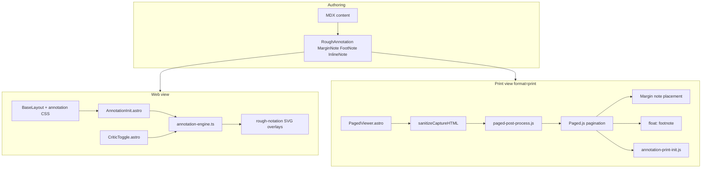

# Annotation System (v2)

> **Status:** Implemented in findcongwang-astro (June 2026)  
> **Supersedes:** Legacy `data-rough*` attributes and `RoughNotationHighlight.astro`  
> **Related:** [`plans/annotation-system-extraction.md`](../plans/annotation-system-extraction.md) (future package split)

## Purpose

The annotation system lets MDX authors layer **semantic meaning** on prose without breaking reading flow:

- **Rough marks** (highlights, boxes, brackets) for emphasis and structure
- **Margin notes** for citations and side commentary (print: right margin)
- **Footnotes** for definitions and digressions (print: page bottom via Paged.js)
- **Inline notes** (ruby/furigana) for density without footnote hops
- **Critic layer** for editorial markup hidden by default (Chief Editor, Academic Critic lenses)

Web and print share the same MDX components. Rendering diverges at runtime: hover tooltips and animated SVG overlays on web; Paged.js layout, margin placement, and static roughNotation on print.

## Architecture



### Web pipeline

1. `BaseLayout.astro` loads `annotation-colours.css`, `annotation-brand.css`, and mounts `AnnotationInit.astro`.
2. On `DOMContentLoaded`, `AnnotationInit` calls `initRoughAnnotations({ animate: true, respectCriticToggle: true })` unless `?format=print` or `?format=slides` (avoids baking SVGs into print capture).
3. `annotation-engine.ts` finds `[data-rough-annotation]`, resolves colours, calls `rough-notation` `annotate()`, registers instances in `window.__annotationRegistry`.
4. `CriticToggle.astro` (on content pages via `ContentLayout`) persists preferences in `localStorage` and dispatches `annotation:preferences-changed`. The engine toggles **SVG overlay visibility only**; wrapped text always stays visible.

### Print pipeline

1. `ContentLayout` wraps article body in `#paged-content` and mounts `PagedViewer` **outside** that container (prevents script re-entry on capture).
2. `PagedViewer` waits for Mermaid, then `document.write()` a clean print document with `paged-book.css` and post-process scripts.
3. `sanitizeCaptureHTML()` strips `<script>` tags, removes orphan `svg.rough-annotation`, and clears `data-rough-annotated` before capture.
4. `paged-post-process.js` transforms margin notes and footnotes, runs `Paged.Previewer().preview()`, then:
   - **Margin notes:** absolute placement in the right margin with overflow continuation across pages
   - **Footnotes:** Paged.js native `float: footnote` (see Footnotes below)
   - **Rough marks:** `initPrintRoughAnnotations()` post-pagination (no animation)
5. Optional `?critic=1` includes critic-layer DOM; default print strips `[data-critic="true"]`.

## Component interfaces

### `RoughAnnotation.astro`

Visual rough-notation wrapper. Renders a `span` or `div` (block types only) with data attributes for the engine.

| Prop | Type | Default | Description |
|------|------|---------|-------------|
| `type` | `"highlight" \| "box" \| "circle" \| "underline" \| "bracket" \| "strikethrough" \| "crossed-off"` | `"highlight"` | rough-notation shape |
| `color` | `string` | `"green"` | Semantic or brand colour key |
| `palette` | `"semantic" \| "brand"` | `"semantic"` | Which CSS token set to use |
| `customColor` | `string` | — | Explicit hex/oklch; bypasses tokens |
| `critic` | `boolean` | `false` | Critic-layer mark; hidden unless critic toggle on |
| `lens` | `"chief-editor" \| "academic-critic"` | — | Sub-filter when critic layer enabled |
| `marginRef` | `number` | — | Sync stroke colour from margin note `[n]` |
| `brackets` | `string` | `"left"` | Comma-separated sides for `type="bracket"` |
| `class` | `string` | — | Additional Tailwind/classes |

**DOM contract:**

```html
<span
  class="rough-annotation"
  data-rough-annotation
  data-type="highlight"
  data-palette="semantic"
  data-color="green"
  data-critic="true"
  data-lens="chief-editor"
  data-margin-ref="5"
  style="--annotation-stroke: var(...); --annotation-highlight: var(...);"
>...</span>
```

**Rules:**

- `palette="brand"` sets `data-brand-mark="true"`. Brand marks **ignore** the master content toggle (always visible).
- `color="red"` without `critic={true}` logs a dev warning (red is critic-exclusive in author mode).
- Prefer `highlight` or `underline` for multi-line text; `box`/`circle` warn in dev when wrapping multiple lines.

### `MarginNote.astro`

Dotted underline + `[n]` badge on web; hover tooltip with optional label. Print: ref span in body + note block in right margin.

| Prop | Type | Default | Description |
|------|------|---------|-------------|
| `n` | `number \| string` | — | Note index (required for cross-ref) |
| `note` | `string` | — | Margin body text |
| `label` | `string` | — | Short heading in tooltip/margin |
| `color` | `SemanticColour` | — | Semantic colour; omit for positional palette by `n` |
| `critic` | `boolean` | `false` | Critic margin note |
| `lens` | `CriticLens` | — | Lens filter |

Wraps slot content (the phrase underlined in prose).

### `FootNote.astro`

Dual-render: web hover + print anchor. Web shows `.footnote-web` only; print shows `.footnote-anchor` only (via CSS).

| Prop | Type | Default | Description |
|------|------|---------|-------------|
| `n` | `number \| string` | — | Footnote number |
| `note` | `string` | — | Footnote body |
| `color` | `SemanticColour` | — | Superscript colour (default accent) |

Slot = inline term (e.g. `Perceptiosphere`).

### `InlineNote.astro`

Ruby-style reading above base text (furigana pattern).

| Prop | Type | Default | Description |
|------|------|---------|-------------|
| `reading` | `string` | — | Text in `<rt>` above slot |
| `color` | `SemanticColour \| string` | — | `#hex` or semantic token |

Slot = base word. Global CSS bumps `line-height` on paragraphs containing `ruby.inline-note`.

### `CriticToggle.astro`

Fixed panel: Content annotations (master), Critic layer, Chief Editor, Academic Critic. Removes critic controls when no `[data-critic]` content on page.

**localStorage keys:**

| Key | Default |
|-----|---------|
| `annotation-master` | `true` |
| `annotation-critic` | `false` |
| `annotation-lens-chief-editor` | `true` |
| `annotation-lens-academic-critic` | `true` |

### Structural (print layout)

| Component | Role |
|-----------|------|
| `PagedViewer.astro` | Detects `?format=print\|slides`, captures `#paged-content`, writes print document |
| `PageBreak.astro` | Section/chapter page breaks |
| `TwoColumn.astro` | Two-column print sections |

## Colour model

Implemented in `src/utils/annotation-colours.ts` and CSS token files.

### Palettes

| Palette | Use | CSS prefix |
|---------|-----|------------|
| **Semantic (author)** | Content annotations | `--annotation-author-{colour}` |
| **Semantic (critic)** | Critic layer | `--annotation-critic-{colour}` |
| **Brand** | Site-native marks (tags, hero, CV) | `--annotation-brand-{key}` |
| **Positional** | Margin notes without `color` prop | Fixed map by `n` (1–7) |
| **Custom** | `customColor` or `#hex` on InlineNote | Inline only |

**Semantic colours:** `blue`, `green`, `red`, `purple`, `amber`, `teal`, `burgundy`

**Brand keys (findcongwang):** `primary`, `yellow`, publish types (`lexicon`, `essay`, …), domain slugs (`domain-bet`, …). Defined in `public/styles/annotation-brand.css`.

### Resolution order (runtime)

1. `data-custom-color` / `customColor` prop
2. Inline `--annotation-stroke` / `--annotation-highlight` on element
3. CSS variables from palette + colour key (+ critic mode)
4. Hex fallback in `resolveColourHex()` for build-time inline styles

## Layer visibility

| Mark type | Master off | Critic off | Brand |
|-----------|------------|------------|-------|
| Author semantic | Hide SVG overlay | — | — |
| Critic semantic | — | Hide SVG / margin note | — |
| Brand | Always show | Always show | — |

Text inside wrappers is **never** hidden; only rough-notation SVG overlays toggle. Margin critic notes use `.margin-note-critic-hidden`.

## Print-specific behaviour

### Footnotes (Paged.js `float: footnote`)

Post-process inserts a sibling `.footnote-float` span after each `.footnote-anchor`:

```html
<span class="footnote-anchor" data-footnote="1">Perceptiosphere</span>
<span class="footnote-float" data-footnote="1">Footnote body text</span>
```

CSS **must** use `.footnote-float { float: footnote; }` without a `body` prefix. Paged.js parses content as a `DocumentFragment`; selectors like `body.paged-mode .footnote-float` never match and footnotes render inline.

`@page { @footnote { float: bottom; } }` in `paged-book.css`. Calls styled via `.footnote-float::footnote-call` (content from `attr(data-footnote)`).

### Margin notes

JS placement after pagination (`distributeMarginNotes` in `paged-post-process.js`). Notes align to ref vertical position, resolve overlaps, continue on following pages when clipped.

### Rough marks in print

- Web init skipped on print URL
- Capture sanitizer removes stale SVGs
- `annotation-print-init.js` clears sibling SVGs, then `annotate()` with `animate: false` per `.pagedjs_page`

### Dual-render components

| Component | Web | Print |
|-----------|-----|-------|
| `FootNote` | `.footnote-web` (hover) | `.footnote-anchor` + `.footnote-float` |
| `MarginNote` | `.margin-note-web` (hover) | `.margin-note-ref` + margin column |

## Engine API (`annotation-engine.ts`)

| Export | Purpose |
|--------|---------|
| `initRoughAnnotations(options?)` | Scan `[data-rough-annotation]`, create overlays |
| `refreshRoughAnnotations()` | Clear and re-init (e.g. after filterable page change) |
| `applyAnnotationVisibility()` | Apply toggle state to registry |
| `saveAnnotationPreference(key, value)` | Persist toggle + apply |
| `getAnnotationRegistry()` | Access live annotation instances |
| `clearAnnotation(el)` | Remove SVG siblings for one element |

**Options:** `root`, `animate`, `respectCriticToggle`

## File map

| Path | Role |
|------|------|
| `src/components/annotations/` | RoughAnnotation, AnnotationInit, CriticToggle, engine |
| `src/components/paged/` | MarginNote, FootNote, InlineNote, PagedViewer, PageBreak, TwoColumn |
| `src/utils/annotation-colours.ts` | Types and colour resolution |
| `public/styles/annotation-colours.css` | Shared semantic tokens |
| `public/styles/annotation-brand.css` | Site brand tokens |
| `public/styles/paged-book.css` | Print typography, margin notes, footnotes, ruby |
| `public/scripts/paged-post-process.js` | Pre-pagination transforms + margin placement |
| `public/scripts/annotation-print-init.js` | Post-pagination roughNotation |
| `public/scripts/rough-notation.esm.js` | Vendored library (ESM) |

## Content author quick reference

```mdx
import RoughAnnotation from '@/components/annotations/RoughAnnotation.astro';
import MarginNote from '@/components/paged/MarginNote.astro';
import FootNote from '@/components/paged/FootNote.astro';
import InlineNote from '@/components/paged/InlineNote.astro';

<RoughAnnotation type="highlight" color="green">Key definition sentence.</RoughAnnotation>

<MarginNote n={1} label="Source" color="blue" note="Full citation text.">
  Phrase with margin reference.
</MarginNote>

This framework builds on the <FootNote n={1} color="burgundy" note="Term definition.">Term</FootNote>.

Agents of <InlineNote reading="deep, narrowly defined" color="green">specialised</InlineNote> expertise.

<RoughAnnotation type="strikethrough" color="red" critic={true} lens="chief-editor">
  Critic-only deletion suggestion.
</RoughAnnotation>
```

Enable print from frontmatter: `formats: ["print"]`. Open `?format=print` (optional `&critic=1`).

## Known constraints

- **Box/circle on multi-line content:** imprecise rects; use highlight/underline.
- **Margin note height:** long notes clip and continue on next page; minor bleed allowed for single-line overflow.
- **Paged.js footnotes:** selector must not depend on `body` ancestor; one `.footnote-float` sibling per anchor.
- **Print capture:** scripts stripped from `#paged-content`; interactive islands must not be required for print layout.
- **Listing badges:** publish-type tag colours on index pages use Tailwind/site CSS, not this annotation system.

## Changelog (v1 → v2)

| Area | v1 | v2 |
|------|----|----|
| Markup | Scattered `data-rough*` | Unified `RoughAnnotation` + data contract |
| Highlights | `RoughNotationHighlight.astro` | Removed; merged into RoughAnnotation |
| Colours | Ad hoc | Semantic + brand palettes, CSS variables |
| Print rough marks | CSS-only or pre-capture SVGs | Post-pagination roughNotation; sanitizer prevents phantom SVGs |
| Footnotes | Post-hoc absolute positioning (overlap bugs) | Paged.js `float: footnote` with reserved footnote area |
| Toggles | Could hide text | Overlay-only; brand exempt |
| Critic | Ad hoc | Lens model + print strip unless `?critic=1` |
