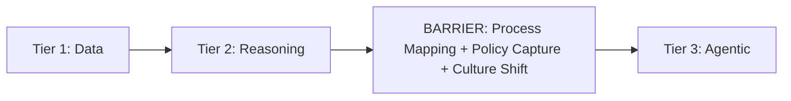

import MarginNote from '@/components/paged/MarginNote.astro';
import FootNote from '@/components/paged/FootNote.astro';
import InlineNote from '@/components/paged/InlineNote.astro';
import RoughAnnotation from '@/components/annotations/RoughAnnotation.astro';
import PageBreak from '@/components/paged/PageBreak.astro';

Most organisations adopt AI tools without a structural understanding of where they sit in a broader progression. The result is scattered pilots, unclear return on investment, and no coherent path to systematic capability. Teams invest in chatbots, automation tools, and analytics dashboards. They see incremental improvements but no fundamental shift in how work gets done. The **AI Adoption Maturity Model** provides that structural framework. It maps the evolution from basic data aggregation to autonomous agent orchestration. The model is not prescriptive about timelines. It does not dictate a specific implementation order. It describes stages of capability that typically emerge in sequence, reflecting how organisations actually gain experience with AI. Each tier represents a qualitative shift in how AI integrates with organisational processes, not merely a quantitative improvement in tool sophistication.

| Tier | Name | Gartner Equivalent | AI Role | Human Role |
|------|------|-------------------|---------|------------|
| 1 | Data Foundation | Descriptive + Diagnostic | Knowledge access layer | Full execution |
| 2 | Reasoning + Insights | Predictive (partial) | Navigator / analyst | Driver (prompts AI) |
| 3 | Agentic Operations | Predictive + Prescriptive | Autonomous executor | Supervisor (sets boundaries) |

<PageBreak />

## Tier 1: Descriptive and Diagnostic (Data Foundation)

Tier 1 defines the baseline capability. Organisations at this tier aggregate structured and unstructured data across systems and establish enterprise-wide search and navigation. AI serves as a **knowledge access layer**: it answers questions about what happened and why, but does not propose actions or anticipate future states.

Key capabilities at Tier 1:

- **Data aggregation**: Investment in data lakes, document management systems, and integration layers that connect disparate sources. AI tools operate on this aggregated data, extracting summaries and identifying patterns.
- **Enterprise-wide semantic search**: AI extends search beyond keyword matching to semantic understanding, allowing users to describe what they need in natural terms. Highest-value Tier 1 capability for knowledge-intensive industries.
- **Root cause analysis**: AI correlates events across systems, identifying patterns that explain anomalies. A drop in conversion rates triggers analysis identifying a website update, a marketing campaign, and a payment provider outage as contributing factors.

Tier 1 represents the foundation upon which all other tiers build. Without reliable data access and descriptive capabilities, agents at higher tiers operate on incomplete information and human reasoning lacks reliable inputs. Most organisations today operate at Tier 1 or are transitioning toward Tier 2. The barrier to Tier 1 is relatively low: data infrastructure investment plus search tools with natural language processing.

<PageBreak />

## Tier 2: AI Reasoning and Insights (Human-Initiated)

Tier 2 marks the transition from information retrieval to reasoning assistance. AI models interact with project context to generate commentary, identify patterns, and support human decision-making. The human remains in the driver's seat, but AI acts as a **navigator** providing analysis that would be costly or impossible to produce manually.

Key capabilities at Tier 2:

- **Interactive reasoning**: Humans ask questions about relationships within a project, not isolated facts. "What are the risks on this product launch?" AI answers by analysing documents, code, email chains, and meeting notes. The output becomes interpretive rather than descriptive.
- **Dynamic visualisation**: AI generates on-demand visualisations showing how metrics relate to other factors. Sales pipeline dashboards include trend overlays, comparison charts, and correlation metrics that respond to user queries.
- **Pattern identification**: AI scans historical similar projects, identifying common blockers, successful strategies, and overlooked risks. Provides a fact base for judgment without recommending a course of action.
- **Draft generation**: A collaborative activity where humans describe purpose, audience, and key points, then AI produces structured outlines and supporting text. The human remains responsible for quality, voice, and strategic alignment.

Tier 2 requires context-aware AI models that understand project structure, document relationships, and stakeholder intentions. Deployment demands investment in embeddings, vector databases, and prompt engineering that handles ambiguity.

<RoughAnnotation type="highlight" color="green">Tier 1 retrieves. Tier 2 synthesises.</RoughAnnotation> Organisations often mistake Tier 2 for Tier 1 because both involve AI responding to human prompts. The distinction lies in depth of reasoning: Tier 1 answers isolated questions; Tier 2 answers questions about complex, interrelated contexts.

<PageBreak />

## Tier 3: Predictive and Prescriptive (Agentic Operations)

Tier 3 represents autonomous operations. Agents do not wait for prompts. They monitor, analyse, and act within their policy-encoded boundaries. AI predicts outcomes and takes action to improve them, within defined parameters.

Key capabilities at Tier 3:

- **Agentic workflows**: An agent monitors a product launch timeline, checks dependencies, assigns tasks, sends notifications, and updates milestones autonomously. Human attention is required for exceptions only. The agent refines its understanding of dependencies through each execution cycle.
- **Prescriptive ecosystems**: Agent fleets identify bottlenecks and execute specialised tasks. A support system detects rising resolution times, analyses historical patterns, and deploys new resolution procedures automatically. Human overseers review a sample of decisions.
- **Human-in-the-loop supervision**: Replaces human-in-the-driver-seat. Supervision means reviewing exceptions, not approving routine actions. A single human supervisor can manage dozens of agents, each handling thousands of routine interactions.

Tier 3 requires two prerequisites that Tier 2 does not:

| Prerequisite | Why It Matters |
|-------------|---------------|
| <RoughAnnotation type="highlight" color="green">Process mapping</RoughAnnotation> | Agents cannot execute processes they do not understand. Each agent's policy layer must encode specific workflows, decision rules, and escalation paths. |
| <RoughAnnotation type="highlight" color="green">Policy as Code</RoughAnnotation> | Agents need encoded governance to ensure autonomous actions align with organisational values and regulations. |

<MarginNote n={1} color="teal" note="See Hybrid Intelligence (HI-Scaling Teams) for the organisational model that Tier 3 enables: small teams of supervisors managing large fleets of specialised agents, each cluster operating under its own policy bundle.">Tier 3 enables the Hybrid Intelligence operating model.</MarginNote> The organisation scales output by adding agent clusters, not human staff.

<PageBreak />

## The Tier 2 to Tier 3 Transition

The transition from Tier 2 to Tier 3 is not a logical progression. It is a threshold change. Organizations often encounter a high barrier at this point. The technical challenges increase, but the structural and cultural challenges dominate. The difficulty is not inventing new capabilities. It is reorganizing around new capabilities.

The three prerequisites for crossing this threshold are:

- **Process mapping**: An organisation that has not documented how work flows through its functions cannot deploy agents to execute that work. This mapping requirement forces organisations to confront ambiguity. Processes that were informal become visible. This visibility creates political tension. People resist having their informal practices codified. They worry that transparency will lead to scrutiny, not automation.

- **Policy capture**: Every decision rule, exception condition, and escalation path must become explicit. This capture translates tribal knowledge into machine-readable form. The organisation gains a shared reference point. It also creates a change management burden. Every policy update requires review and approval. The pace of change slows, but the quality of decisions improves.

- **Culture shift**: The shift from "I use AI" to "AI operates under my oversight" changes daily rhythms. Supervisors no longer perform routine work. They monitor exceptions, refine policies, and coordinate across agent clusters. This change demands new competencies in policy design, systems leadership, and exception management.

Most organisations stall at Tier 2 for several reasons. They lack the process mapping foundation. They resist policy codification because it exposes ambiguity. They are not prepared for the cultural shift required. The Tier 3 transition demands both technical investment and organisational change. Organisations that treat it as a technical problem alone will see failed deployments. Organisations that treat it as a change initiative will see sustainable progression.

## Mapping Analytics to AI Maturity

<MarginNote n={2} label="Gartner (2024)" color="blue" note="Gartner's analytics maturity framework describes four stages: descriptive (what happened), diagnostic (why), predictive (what will happen), and prescriptive (what to do). This model adapts the framework from tool capability to organisational capability, with the key shift being that 'prescriptive' becomes autonomous agency rather than human-facing recommendations.">The AI Adoption Maturity Model draws from Gartner's analytics maturity framework.</MarginNote> The adaptation maps analytical stages to organisational capability:

| Gartner Stage | AI Maturity Equivalent | Key Shift |
|--------------|----------------------|-----------|
| Descriptive | Tier 1: Data aggregation and search | What happened? |
| Diagnostic | Tier 1-2: Root cause and pattern analysis | Why did it happen? |
| Predictive | Tier 3: Agent monitoring and anticipation | What will happen? |
| Prescriptive | Tier 3: Autonomous execution within policy | What should we do? (and then doing it) |

The key adaptation is in the prescriptive stage. In traditional analytics, prescriptive models provide recommendations to humans. In AI adoption, prescriptive capability means autonomous agency: agents execute within policy boundaries without human prompting.

The model incorporates lessons from enterprise architecture. Tier 1 requires data architecture. Tier 2 requires process architecture. Tier 3 requires governance architecture. Progression depends on completing the previous layer. The model serves as a diagnostic tool for organisations to identify where they stand and prioritise investments.

## References

- Gartner. *Analytics maturity model defining descriptive, diagnostic, predictive, and prescriptive stages of analytical capability.* 2024, Report G00794278.

## Cross-links

- [Agent Fleet Composition](/lexicon/agent-fleet-composition)
- [Hybrid Intelligence](/lexicon/hybrid-intelligence)
- [Organisational Design as Code](/lexicon/organisational-design-as-code)
- [Perceptiosphere](/lexicon/perceptiosphere)
- [Process Mapping from Business Models](/lexicon/process-mapping-from-business-models)
- [Strategy Map](/lexicon/strategy-map)