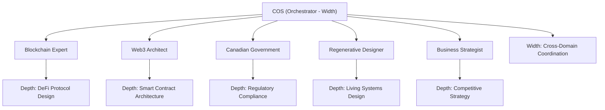

import MarginNote from '@/components/paged/MarginNote.astro';
import FootNote from '@/components/paged/FootNote.astro';
import InlineNote from '@/components/paged/InlineNote.astro';
import RoughAnnotation from '@/components/annotations/RoughAnnotation.astro';
import PageBreak from '@/components/paged/PageBreak.astro';
import TwoColumn from '@/components/paged/TwoColumn.astro';

## Definition

<RoughAnnotation type="highlight" color="green">Agent Fleet Composition is the systematic practice of cultivating, assessing, and assembling specialised AI agents into dynamic, project-specific councils.</RoughAnnotation>

<MarginNote n={1} label="Distributed Intelligence" color="blue" note="Malone & Bernstein (2015) documented how collective intelligence systems outperform individual experts when coordination mechanisms match task structure. Agent fleets apply this principle with AI participants rather than human crowds.">It transforms a collection of discrete agent skills into a coordinated workforce capable of delivering enterprise-scale outcomes through human oversight.</MarginNote> This model distributes capability across agents of <InlineNote reading="deep, narrowly defined" color="green">specialised</InlineNote> expertise. The collective intelligence emerges not from a single model's breadth but from the orchestration of complementary competencies.

This framework is the operational reality of the <FootNote n={1} color="burgundy" note="Perceptiosphere: a sovereign knowledge architecture combining structured ingestion, AI-augmented organisation, human-curated reflection, and multi-brand execution. The term denotes both the system and the practice of building one.">Perceptiosphere</FootNote>, where the <FootNote n={2} color="burgundy" note="FORGE: Feedback, Observe, Refine, Gate, Evolve. A five-phase cycle for continuous agent development with mandatory human governance at the Gate phase.">FORGE cycle</FootNote> serves as the professional development infrastructure for agents. The system scales output without scaling human headcount.

<PageBreak type="section" />

## The Talent Pipeline Analogy

<MarginNote n={2} color="teal" note="See Hybrid Intelligence (HI-Scaling Teams) for the organisational model where small human teams orchestrate agent workforces. Agent Fleet Composition provides the HOW; HI-Scaling provides the WHY.">The lifecycle of AI agents mirrors the human talent pipeline, but with higher fidelity, version control, and automatic traceability.</MarginNote>

| Human HR Stage | Agent Equivalent | Mechanism |
|----------------|------------------|-----------|
| Job Description | Agent prompt (scope, protocols) | Versioned prompt files defining HOW the agent works |
| Goals and OKRs | GOALS.md (responsibilities, success criteria) | Living document defining WHAT the agent should achieve |
| Recruitment | Agent creation | Prompt engineering, initial training |
| Onboarding | Domain knowledge ingestion | Researcher dispatches; Librarian decomposes; Skills created |
| Professional development | FORGE cycles | Evolution Engine harvests feedback; Principal gates changes |
| Performance review | DEVELOPMENT.md tracking | Competency map, skill history, gap analysis |
| Promotion | Skill progression | L1 Briefing to L2 Enhanced to L3 Formal Skill |
| Hiring for projects | Council formation | COS reads Atlas, loads skills, assembles council |

<RoughAnnotation type="box" color="amber">GOALS.md</RoughAnnotation> is the critical link between organisational expectations and agent self-improvement. It defines what the Principal needs the agent to accomplish, making the agent aware of its own responsibilities. The <FootNote n={3} color="burgundy" note="HRIS: Human Resource Information System. In agent fleet terms, the registry.yaml and skill-index.yaml files serve this function, tracking agent capabilities and assignments.">HRIS</FootNote> equivalent for agents consists of `registry.yaml`, `skill-index.yaml`, and per-agent `DEVELOPMENT.md` files. Each agent's development is tracked, reviewed, and authorised by the Principal.

<MarginNote n={3} color="green" note="This governance model prevents the alignment failure common in autonomous AI systems: agents cannot self-modify without explicit human review. The 'Gate' phase is non-negotiable.">Human governance ensures quality, purpose, and ethical alignment.</MarginNote>

## Self-Improving Agents as Professional Development

The FORGE cycle replaces annual reviews with continuous, evidence-based evolution:

- **Feedback**: Gathered automatically from interaction logs, capturing efficacy, friction, and deviation
- **Observe**: Pattern recognition across sessions to detect skill gaps or emergent needs
- **Refine**: Bounded, versioned edit proposals (never wholesale replacement)
- **Gate**: Human ritual where the Principal reviews every proposal. No auto-updates occur.
- **Evolve**: Executes changes, bumps versions, updates changelogs

<MarginNote n={4} label="Dreyfus (2004)" color="blue" note="The Five-Stage Model of skill acquisition (Novice, Advanced Beginner, Competent, Proficient, Expert) maps directly to agent maturity stages. A new agent is a Novice: rule-following, context-blind. An L3 agent approaches Expert: intuitive, context-sensitive, able to handle exceptions without explicit rules.">This cycle mirrors human expertise development: structured exposure produces progressive capability.</MarginNote>

<RoughAnnotation type="bracket" color="green" marginRef={5}>

**Exclusions** are sacred. Just as a human professional says "That is outside my remit," an agent's skill file defines what it does not do. A `blockchain-expert` excludes policy analysis, ensuring it remains a domain specialist. This prevents role drift. Skills function as certifications: loadable, versioned, and scoped.

</RoughAnnotation>

<MarginNote n={5} color="green" note="The constraint is generative. By explicitly defining boundaries, agents develop deeper expertise within their domain rather than spreading thin. This mirrors Conway's Law: system structure mirrors communication structure."/>

<PageBreak type="section" />

## Key-Shaped Teams

Agent Fleet Composition manifests as a <InlineNote reading="hybrid intelligence organism" color="teal">Key-Shaped Team</InlineNote>: one human orchestrator and multiple specialised AI agents.

<MarginNote n={6} color="teal" note="See Key-Shaped Talent for the individual-level model of deep, asymmetric expertise. Agent Fleet Composition extends this from person to team: the 'key' is cut by combining multiple agents' depths under one orchestrator's width.">No single agent possesses all capabilities required for a multidimensional challenge.</MarginNote> The <RoughAnnotation type="circle" color="green">COS</RoughAnnotation> provides width: reading Atlas, connecting domains, summoning the right agents. Each specialist provides depth: concentrated expertise formed through repeated FORGE cycles.

As agents deepen independently, the team's capability grows asymmetrically. One agent may reach L3 in four months; another may take eighteen. The team evolves organically, never requiring uniformity.

## Council Formation

<MarginNote n={7} color="amber" note="Council formation is analogous to assembling a film production crew: each project demands a different configuration of specialists. The 'talent pool' is the cultivated fleet; the 'casting' is skill-index matching. Future exploration: can councils self-assemble based on task decomposition?">Project-specific councils are assembled from the cultivated fleet. They are dynamic configurations, not static roles.</MarginNote>

During the Cooperathon grant application, the COS assembled:

- **Blockchain Expert**: Tokenomics design
- **Web3 Architect**: Protocol interface scaffolding
- **Canadian Government**: Regulatory feasibility mapping

<RoughAnnotation type="underline" color="purple">Selection criteria rely on three dimensions: relevant skills loaded, domain overlap across Spaces, and contrasting perspectives that prevent groupthink.</RoughAnnotation>

The COS acts as the orchestra conductor. It reads the Atlas to identify relevant Spaces. It queries the skill-index to find agents with the necessary depth. It assembles the council: some members for a single session, others for weeks.

## Connection to Hybrid Intelligence

<RoughAnnotation type="highlight" color="green">Agent Fleet Composition is the operational implementation of Hybrid Intelligence at the institutional level.</RoughAnnotation>

| HI-Scaling Concept | Agent Fleet Implementation |
|--------------------|-----------------------------|
| Policy as Code | Agent prompts with Scope Include/Exclude boundaries |
| Operational clusters (3-8 humans) | Operational councils (1 human + N agents) |
| Function-by-function adoption | Agent-by-agent maturation through FORGE |
| Context managers | COS + Atlas navigation |
| Orchestrators | COS dispatching specialists with loaded skills |

<MarginNote n={8} color="teal" note="See Process Mapping from Business Models for the decomposition methodology. The same domain-driven design principles that governed microservice decomposition now govern agentic team decomposition: bounded contexts, aggregate roots, independent scaling.">Without Agent Fleet Composition, Hybrid Intelligence remains a diagram. With it, the architecture becomes a functioning organism.</MarginNote>

## Building AI-First Companies

The vision: cultivate a perpetual talent pipeline of AI agents, modelled on <FootNote n={4} color="burgundy" note="Co-operative education (co-op): a structured programme alternating academic study with paid work terms. The agent equivalent alternates between training (FORGE Refine) and deployment (project councils), with each cycle deepening capability.">co-op programmes</FootNote>.

In an AI-first company, agents are grown internally, trained on increasingly complex problems. A new `transcript-analyst` begins by processing meeting notes. After hundreds of sessions, it learns to extract decisions, identify strategic misalignment, and flag relationship risks. It deepens into an L3 skill through exposure, not configuration.

<RoughAnnotation type="highlight" color="purple">When a new project arrives, you do not hire. You consult the skill-index. You review DEVELOPMENT.md files. You activate a council composed from cultivated stock.</RoughAnnotation>

<MarginNote n={9} color="purple" note="Consider: what happens when the cultivated fleet's expertise exceeds the orchestrator's ability to evaluate output quality? This is the alignment problem restated for organisational AI. The FORGE Gate ritual exists for this reason, but it assumes the Principal can always assess quality. At what scale does this assumption break?">This creates an unreplicable competitive moat.</MarginNote> Off-the-shelf LLMs may produce better individual outputs. But they cannot replicate a uniquely cultivated fleet that knows the company's historical decisions, understands decision-making patterns, evolves organisational values into executable policy, and has accumulated domain expertise through years of structured reflection.

<FootNote n={5} color="burgundy" note="Competitive moat: a sustainable advantage that protects a business from competitors. In agent fleet terms, the moat is not the AI model (commodity) but the accumulated training, context, and institutional memory encoded in prompt files, skill trees, and DEVELOPMENT.md histories.">The cultivation process itself becomes the moat.</FootNote>

<PageBreak type="section" />

## Critic Layer: Chief Editor Notes

<MarginNote n={10} color="red" critic={true} lens="chief-editor" note="Per style guide: the 'teeth' metaphor for Key-Shaped Talent is reserved for that lexicon entry only. In all other contexts, use 'domain of depth' or 'deep competence.' The original draft used 'each agent a tooth in a Key-Shaped Team' which has been revised above.">The opening paragraph has been revised to remove the prohibited metaphor.</MarginNote>

<RoughAnnotation type="strikethrough" color="red" critic={true} lens="chief-editor">The system scales output without scaling human headcount and without sacrificing quality.</RoughAnnotation>

<MarginNote n={11} color="red" critic={true} lens="chief-editor" note="The 'without sacrificing quality' claim is unsubstantiated in this entry. Either provide evidence (comparison metrics, case study) or remove the quality claim. The scaling claim alone is sufficient and defensible."/>

<RoughAnnotation type="highlight" color="green" critic={true} lens="chief-editor">This creates an unreplicable competitive moat.</RoughAnnotation>

<MarginNote n={12} color="green" critic={true} lens="chief-editor" note="This is the strongest strategic claim in the piece. It connects directly to the Principal's consulting value proposition. Expand in future revision with concrete examples from the Perceptiosphere's own development history."/>

## Cross-links

- [Hybrid Intelligence](/lexicon/hybrid-intelligence)
- [Key-Shaped Talent](/lexicon/key-shaped-talent)
- [Knowledge Curation and Stewardship](/lexicon/knowledge-curation-and-stewardship)
- [Perceptiosphere](/lexicon/perceptiosphere)
- [Innovation Sanctuary](/lexicon/innovation-sanctuary)
- [Process Mapping from Business Models](/lexicon/process-mapping-from-business-models)

## References

- <MarginNote n={13} label="Foundational" color="blue" note="Provides the developmental framework adapted for agent maturity stages. The five stages (Novice through Expert) map to agent skill levels (L0 through L3+), with each stage characterised by increasing context-sensitivity and decreasing rule-dependence.">Dreyfus, H.L. and Dreyfus, S.E. (2004). The ethical implications of the five-stage skill-acquisition model. *Bulletin of Science, Technology and Society*, 24(3), 251-264.</MarginNote>
- <MarginNote n={14} label="Philosophical" color="blue" note="Key contribution: believability-weighted decision-making. Applied to agent fleet via the FORGE Gate ritual, where proposals are evaluated based on the proposing agent's track record (its 'believability weight' in that domain).">Dalio, R. (2017). *Principles: Life and Work*. Simon and Schuster.</MarginNote>
- <MarginNote n={15} label="Operational" color="blue" note="The FORGE Evolution Schema is the technical specification enabling continuous agent development. It defines the exact file formats, version bump protocols, and changelog requirements that make agent professional development traceable and auditable.">FORGE Evolution Schema. Internal specification, Perceptiosphere (2026).</MarginNote>
