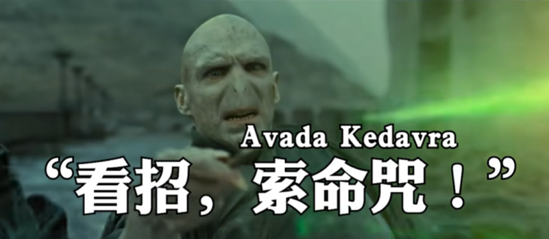
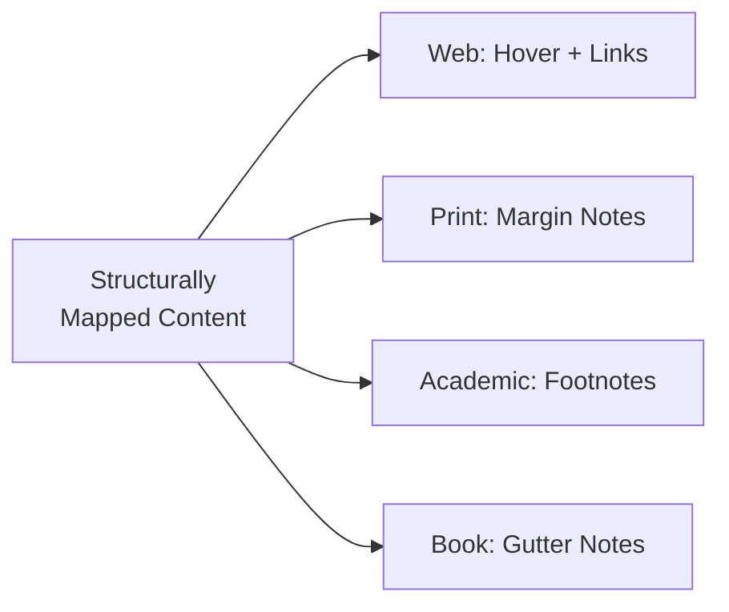

import MarginNote from '@/components/paged/MarginNote.astro';
import PageBreak from '@/components/paged/PageBreak.astro';
import TwoColumn from '@/components/paged/TwoColumn.astro';
import InlineNote from '@/components/paged/InlineNote.astro';
import FootNote from '@/components/paged/FootNote.astro';

## Introduction — The Density Problem

<MarginNote n={1} label="Bandwidth" note="Pellegrino et al. (2011) showed all languages transmit at ~39 bits/second, trading syllable rate for information density per syllable. The constraint isn't capacity — it's formatting architecture.">English communicates meaning almost <InlineNote reading="with less glance value">entirely through horizontal linear text.</InlineNote></MarginNote> When concepts carry layered context, cultural history, or technical precision, English forces you to either expand horizontally (verbose parentheticals, subordinate clauses), break flow (footnotes send the reader away), or sacrifice density (simplify and lose the multi-layered meaning). This is experienced as a loss of ability to communicate what is in one's head through the written word. The concepts are there, interconnected and layered, but the medium of English prose forces linearisation.

Other writing traditions solved this through structural innovation.

## The Japanese Precedent: Dual-Channel Meaning

<MarginNote n={2} label="Ruby text" note="The HTML ruby tag derives directly from this Japanese typographic tradition. The term 'ruby' comes from the 5.5pt type size used for interlinear annotations in British typography.">**Furigana** (振り仮名): small kana printed above kanji to indicate pronunciation.</MarginNote> Standard in educational materials and complex texts. Called "ruby text" in web typography.

**Ateji/Gikun** (当て字/義訓): characters whose standard reading is deliberately overridden. The written kanji carries semantic/cultural weight from one tradition while the pronunciation annotation carries a different meaning. TWO channels of information in the same horizontal space.

<MarginNote n={3} note="This technique is common in anime and manga, where it functions as a literary device that creates irony, metaphor, or character voice — the gap between written and spoken IS the meaning.">Key example: writing 世界 (sekai, "world") with furigana reading ゆめ (yume, "dream") communicates "this character sees the world as a dream" in two characters rather than a sentence.</MarginNote>

The analogy to spells: the speech is how you invoke it; the written form is what is spelled (proper noun with philosophical anchoring). Both channels carry meaning; the gap between them IS the literary device.

Historical reason: Japanese imported Chinese characters onto an existing spoken language, creating a fundamental architectural separation between glyph and sound that alphabetic systems never developed.

**Katakana** as a dedicated loan-word channel: any foreign sound can be imported phonetically. The script itself signals "this concept came from outside Japanese." Cultural borrowing made architecturally visible.

Chinese media is now adopting similar annotation practices (characters with pronunciation guides above), which is natural since Chinese historically had the same system.

The key insight: Japanese writing is natively a two-dimensional information system. The horizontal axis carries semantic content; the annotation axis carries phonetic or alternative semantic content. The system tolerates and celebrates disagreement between these channels.

## The Gutter: Meaning in the Gaps (Scott McCloud)

<MarginNote n={4} label="McCloud (1993)" note="McCloud identifies six transition types: moment-to-moment, action-to-action, subject-to-subject, scene-to-scene, aspect-to-aspect, and non-sequitur — each demanding progressively more reader participation.">Scott McCloud's *Understanding Comics* Chapter 3 ("Blood in the Gutter") introduces **closure**: the reader constructs meaning in the space between comic panels.</MarginNote>

The gutter (space between panels) is not empty. It is where imagination takes hold. The reader infers action, time, causation from what is NOT shown.

Six transition types represent a spectrum of information density in the gap:
- Moment-to-moment (near-zero closure) → Non-sequitur (maximum reader construction)

Structural parallel to annotation: the annotation space (margin, footnote, furigana) carries meaning that the main text alone does not contain. The gap between explicit content and annotation is where the richest comprehension occurs.

Cultural observation: Western comics favour action-to-action (plot-driven, explicit). Japanese manga favours aspect-to-aspect (atmospheric, implied). This mirrors the density difference between English (horizontal, explicit) and Japanese (vertical, layered) writing systems.

The gutter IS the annotation. Different annotation formats demand different cognitive participation levels.

## The Annotation Tradition

<TwoColumn>

**Medieval interlinear glossing** (Lindisfarne Gospels, ~950 CE): Old English pronunciation written above Latin text. Functionally identical to furigana. The vertical axis existed in Western tradition too, but was abandoned in favour of footnotes.

<MarginNote n={5} label="Spatial argument" note="The Talmud page is perhaps the strongest historical precedent for what we're building here — a system where position on the page encodes authority, temporality, and argumentative relationship.">**Talmud page architecture** (codified ~500 CE, printed 1520): Centre text (Mishnah + Gemara), inner margin (Rashi's commentary, 11th century), outer margin (Tosafot, 12th-13th century).</MarginNote> The LAYOUT is the argument. Position on page encodes temporal layer and authority level. A reader navigates spatially, not linearly.

**Musical scores**: Pitch (vertical), time (horizontal), dynamics (annotations above/below), multiple voices (staves). A genuinely multi-dimensional annotation system. The conductor's score is the closest Western equivalent to the Talmud page.

<MarginNote n={6} label="Wallace" note="In Quack This Way (2013): 'a good comma functions like a yellow traffic light; not requiring you to stop, but advising you to slow down.' Formatting as empathy.">**David Foster Wallace's endnotes**: Not scholarly citations but narrative digressions. The main text is what you're saying; the endnotes are what you're thinking while saying it.</MarginNote> His teaching philosophy: punctuation as "structural signposts" for processing dense information. His empathy argument: complex formatting serves accessibility of complex thought; it builds scaffolding so the reader can hold more complexity without collapsing.

</TwoColumn>

<PageBreak type="section" />

## The English Limitation

<FootNote n={1} note="International Phonetic Alphabet — a standardized system of phonetic notation using Latin characters and diacritics to represent the sounds of all spoken languages.">IPA</FootNote> exists but is inline/horizontal. Inserting [ˈkaʊn.sɪl] after a word changes sentence structure and composition. It lacks the right-then-and-there annotated value of a denser system.

Idioms function as compression (short placeholder referencing entire cultural stories) but are lossy — if you lack the context, decompression fails.

The ~39 bits/second universal bandwidth constraint (Pellegrino et al., 2011): all languages transmit at roughly equal information rates, trading density for speed. The problem isn't English's capacity; it's its formatting architecture.

The "Council of Elders" example: in English, you must either explain the term inline (verbose) or hope the reader knows. In a dual-channel system, you write one thing and annotate the cultural context above it, communicating both simultaneously without expanding the sentence.

What's missing: a way to stack meaning vertically within English text. Line height spacing, gutter notes between lines, superscript references to margin blocks — these are architectural solutions, not linguistic ones.

## Toward Multi-Channel English: A Rendering Architecture

<MarginNote n={7} label="This page" note="You are reading a demonstration of this principle. If viewing on the web, hover over the numbered markers to see annotations. If viewing in print mode (?format=print), these same annotations appear as margin notes in the page gutter.">The principle: content should be **structurally mapped** with links and annotations baked into the authored source, then rendered differently per medium.</MarginNote>

Not "add footnotes later" but "the annotation IS part of the authored content."

| Medium | Annotation Renders As |
|--------|----------------------|
| Digital (web) | Hover tooltips showing annotated bibliography of why this link is relevant in this context |
| Digital (book/PDF) | Margin notes, gutter annotations |
| Print (academic) | Footnotes, endnotes |
| Print (literary) | Margin notes, inline bracketed notes |

Each link carries an annotated bibliography: not just WHERE it goes but WHY it's relevant in THIS context. In a digital format, hover over a link to see both the target and the annotation explaining the connection. In print, no hover capability, so the same information must render as margin notes, footnotes, or inline commentary.

One authored source, multiple renderings. The knowledge mesh underneath is the same; only the presentation layer changes.

This is relevant for the design of the book layouts: margin notes and annotated bibliographies creating a specific print layout where every concept reference is structurally linked and the reader can choose their depth.

<PageBreak type="section" />

## References

- Grafton, Anthony. *The Footnote: A Curious History.* Harvard University Press, 1997. Traces footnotes from classical scholarship to modern academia.
- Jackson, H.J. *Marginalia: Readers Writing in Books.* Yale University Press, 2001. Definitive history of annotation practices.
- Kalir, Remi & Garcia, Antero. *Annotation.* MIT Press, 2021. Comprehensive treatment spanning medieval to digital annotation.
- McCloud, Scott. *Understanding Comics: The Invisible Art.* HarperPerennial, 1993. Chapter 3: closure, gutter transitions, and meaning in gaps.
- Pellegrino, François et al. "A Cross-Language Perspective on Speech Information Rate." *Language* 87.3 (2011): 539-558. Universal bandwidth constraint across languages.
- Wallace, David Foster & Garner, Bryan A. *Quack This Way.* RosePen Books, 2013. Punctuation as structural signposts and the empathy of formatting.

## Cross-links

- [Knowledge Composability](/lexicon/knowledge-composability)
- [Knowledge Curation and Stewardship](/lexicon/knowledge-curation)
- [Perceptiosphere](/lexicon/perceptiosphere)
- [Structured Reflection](/lexicon/structured-reflection)
