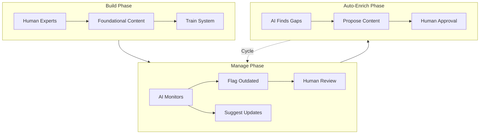

## Introduction

Build-to-Manage is a cross-sector revenue model where capital-intensive asset construction transitions into recurring management fees. This pattern appears in fund management, renewable energy, knowledge platforms, and workforce modernisation. What makes it increasingly powerful now is artificial intelligence: AI dramatically reduces the cost of management while improving quality and consistency. The core principle remains stable: assets must retain intrinsic operational value that cannot be reduced to zero. Innovations layer on this foundation, but do not replace it.

## The Pattern Across Sectors

| Sector | Build Phase | Manage Phase | Revenue Pattern |
|--------|-------------|--------------|-----------------|
| **Renewable Energy** | Development fee to build capacity (solar, batteries, infrastructure) | Fee to manage capacity (O&M contracts for asset owners/beneficiaries) | CapEx build → OpEx management fee |
| **Strategic Fund** | Acquire businesses with existing operational revenue around a shared strategic vision | Shared services, operational leverage, technology improvement | Acquisition cost → recurring management + improvement fees |
| **Knowledge Platforms** | Human experts create foundational content, train AI system | AI maintains content health, flags outdated material, enriches | Consulting project → subscription retainer |
| **AI-Ready Workforce (CTC-Rx)** | Build business process mappings, agentic infrastructure for companies crossing back over the chasm | Manage modernisation as ongoing service; deploy AI-ready workforce | Service engagement → managed modernisation contract |

Renewable energy exemplifies this model: developers bear the capital expenditure to install solar panels or battery systems, then earn operational revenue through long-term operations and maintenance contracts. The asset requires stewardship; the builder becomes the steward.

Strategic funds inspired by Constellation Software acquire businesses with existing revenue streams aligned to a shared strategic vision. Value is created not through speculative exits, but through shared technology platforms and operational improvements. Portfolio companies are selected for their stable, non-zero revenue base; innovation enhances the core, rather than replaces it.

Knowledge platforms follow a similar progression: experts build foundational content, train the initial AI system, and establish quality baselines. The AI then maintains content health, flags outdated material, and suggests updates. Fees shift from one-off consulting to ongoing subscriptions.

The AI-Ready Workforce model, or CTC-Rx, addresses the reverse chasm: companies that waited until technology was proven now need affordable adoption support. While large firms hire consultants, SMEs lack resources. A nonprofit like Nova Roma builds the agentic infrastructure and process mappings, then manages ongoing modernisation as a recurring service: training, deploying, and supporting an AI-ready workforce.

## Applied to Knowledge Platforms

Knowledge platforms implement Build-to-Manage through three phases:

- **Build Phase**: Human experts create foundational content and train the initial AI system. High cost, high human involvement.
- **Manage Phase**: AI monitors content, flags outdated material, and suggests updates. Human review ensures compliance and quality.
- **Auto-Enrich Phase**: AI identifies knowledge gaps, proposes new content, and cross-links discoveries. Human approval determines promotion.

Real-world example: medical education platforms under FDA and Health Canada compliance. Experts build initial procedure protocols. AI flags regulatory changes. AI identifies new procedures from literature and proposes additions. This ensures continuous accuracy at lower cost.

## The Knowledge Bank

The platform operates as a knowledge bank. Users deposit structured content and withdraw insights. Transaction fees mirror banking models: small levies for access, retrieval, or contribution. A credit system rewards high-quality contributions and impact. The bank itself is the stable asset: build the infrastructure, then manage deposits and transactions for a fee.

## Why AI Changes the Economics

Management traditionally required expensive human labour: quality control, content review, gap identification. AI removes these cost barriers. Margins on the management fee rise because delivery costs fall. A single team can now manage hundreds of knowledge assets simultaneously, applying the principle of Hybrid Intelligence. Auto-enrichment generates expansion revenue without proportional effort: AI identifies new content opportunities, and human review only activates at promotion stage.

## The Acquisition Variant

Instead of building from scratch, acquire existing systems: SMEs with legacy knowledge bases, operational businesses with stable revenue. Upgrade them with AI management capabilities. Operate under a shared platform with shared services. The "build" phase becomes "acquire + upgrade." The stable core (existing operational revenue) is already present. The value-add is the management layer.

## Cross-links

- [AI Adoption Maturity Model](/lexicon/ai-adoption-maturity-model)
- [Hybrid Intelligence](/lexicon/hybrid-intelligence)
- [Knowledge Curation and Stewardship](/lexicon/knowledge-curation)
- [Perceptiosphere](/lexicon/perceptiosphere)
- [Process Mapping from Business Models](/lexicon/process-mapping-from-business-models)
- [The Next IP: Knowledge Context](/lexicon/the-next-ip-knowledge-context)

## References

- Moore, Geoffrey A. Crossing the Chasm. HarperBusiness, 1991. The original chasm model; Build-to-Manage addresses the reverse phenomenon (CTC-Rx) where companies cross back toward adoption after technology matures.
- Wang, Francis & Lim, Pyn. Discussion on AI for Medical Education & Business Development. April 22, 2026.
- Wang, Francis & Yao, William. Discussion on AI Knowledge Platform Business Model. May 16, 2026.
- Wang, Francis & Wylant, Barry. Discussion on Tripartite Innovation Ecosystem Model. February 17, 2026.