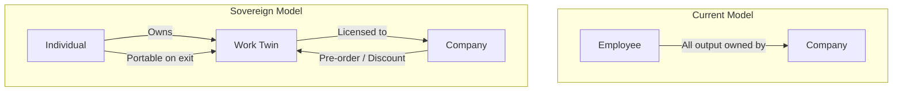

## Introduction

If you work for a company in the future for some time, do they own the rights to an agent modelled after how you work? Do they own your agent?

**Digital Sovereignty** is the principle that individuals own their AI agent's trained context, outputs, and the right to deploy, withdraw, or license the agent. A **work twin** (also: co-agent, chief of staff agent) is an AI agent trained on your patterns, thinking, and sovereign data that operates on your behalf. Multiple terms are converging on this concept from different directions.

## The Work Twin

A work twin is an extension of your accumulated expertise, trained on your interactions, decisions, and context. It mirrors your cognitive patterns and operational preferences. Variations include co-agent, chief of staff agent, and agent of record. Unlike a chatbot or productivity app, a work twin emerges from sustained interaction and retains state across sessions. It is not static. Its value derives from its fidelity to your working style and access to your sovereign knowledge.

## Sovereignty as Governance Principle

Digital Sovereignty extends the data sovereignty movement (seen in GDPR's right to data portability and Indigenous data sovereignty frameworks) into the domain of AI agent ownership. Ownership means:

- **Control over trained context**: You alone determine how your agent’s weights and memory are used.
- **Portability**: Your work twin moves with you between organisations.
- **Consent**: Access to your agent’s output must be explicitly licensed, not assumed.
- **Non-claim**: Employers cannot claim ownership of your agent’s learned patterns as corporate intellectual property.

This reframes the relationship between human and agent: the agent is not a corporate asset; it is your operational proxy.

## The Shape of Future Employment

Current employment models assume that all output during employment belongs to the employer. Applied to agents, this implies the company owns a digital copy of you. This is ethically untenable.

Instead, consider these structural models:

| Model | Mechanism | Analogy |
|-------|-----------|---------|
| **Convertible note (inverted)** | Company pre-orders access to your agent at a discounted licensing rate | Investors receive discounted equity via convertible notes; here the individual is the asset |
| **Cliff mechanism** | Tenure unlocks deeper access; short engagements grant no premium rights | Vesting schedules in equity compensation |
| **Royalty model** | Company pays ongoing royalties for continued use of your agent's patterns | Music licensing, patent royalties |
| **One-time buyout** | Company negotiates a buyout of specific capabilities (e.g., a crisis response protocol) | IP acquisition deals |
| **Portability** | On exit, your work twin leaves with you; company retains outputs but not generative capacity | Employee taking their skills and network when they leave |

These models are not mutually exclusive. A sovereign employment contract might combine a cliff with royalties: the company gains discounted access after two years, pays royalties for continued use after departure, and never claims ownership of the underlying agent.

## From Employment to Portfolio Management

The logical extension of sovereign work twins is that employment itself transforms. Rather than selling time to a single employer, individuals manage a **portfolio of context licenses**. Different organisations license different facets of your agent's capability:

- One company licenses your strategic foresight patterns
- Another licenses your technical architecture decisions
- A third licenses your mentoring and coaching protocols

Each license operates under its own terms, duration, and exclusivity. The individual becomes a portfolio manager of their own cognitive output, deciding where to allocate their agent's availability and at what price. This is not gig work (which commoditises labour into interchangeable tasks). This is context licensing (which values the irreplaceable patterns of an individual's expertise).

The shift from "hours billed" to "context usage" tracked via verifiable protocols represents a fundamental restructuring of how knowledge work generates economic value.

## The Economics of Context

This transition raises a compelling question that frames the broader discourse:

> How might we design a Digital Sovereignty economy where individuals license their dynamic context to generate perpetual value, without the value of that context collapsing due to "static decay," and without exposing individual creators to catastrophic personal liability for their agent's autonomous actions?

Three forces shape this economy:

- **The commoditised context trap**: If everyone licenses similar agents trained on similar data, context races to the bottom in value. Differentiation requires sustained curation and genuine expertise (connecting directly to [Key-Shaped Talent](/lexicon/key-shaped-talent) and the development of deep competence).

- **Static decay**: An agent that stops learning loses value. Yesterday's trained context becomes stale as domains evolve. Continuous learning through exposure to new inputs, feedback loops, and structured reflection is required to avoid value collapse. This makes ongoing stewardship inseparable from economic viability.

- **Liability and provenance**: When your agent acts autonomously, who bears responsibility for errors? Provenance-tracking protocols (potentially blockchain-based smart contracts that record context usage, decision chains, and attribution) offer a path toward accountability without surveillance. The technical infrastructure for tracking "context usage" rather than "hours billed" remains an open design challenge.

## Connection to the Perceptiosphere

The work twin operates from your sovereign Core outward. Its context is not stored in external platforms; it resides within your layered Perceptiosphere, governed by access rules that determine what it can learn, share, or expose. The twin is the operational arm of your [Knowledge Curation and Stewardship](/lexicon/knowledge-curation) discipline.

The spatial layers of the Perceptiosphere provide the governance architecture:

- **Core (Sovereign)**: The twin's full trained context, accessible only to you
- **Closed Social**: Shared selectively with trusted collaborators or close partners
- **Community of Practice**: Licensed capabilities available to organisational clusters
- **Public**: Published outputs, open contributions, portfolio demonstration

Movement between layers requires deliberate consent. No platform or employer can extract context from an inner layer without the individual's explicit decision to contribute outward.

## Cross-links

- [Hybrid Intelligence](/lexicon/hybrid-intelligence)
- [IMAGINE Framework](/lexicon/imagine-framework)
- [Innovation Sanctuary](/lexicon/innovation-sanctuary)
- [Key-Shaped Talent](/lexicon/key-shaped-talent)
- [Knowledge Curation and Stewardship](/lexicon/knowledge-curation)
- [Perceptiosphere](/lexicon/perceptiosphere)

## References

- Nissenbaum, Helen. *Privacy in Context.* Stanford University Press, 2010.
- European Union. General Data Protection Regulation (GDPR) 2016/679.
- Wang, Francis. *Perceptiosphere*. 2026.
- Wang, Francis. *Hybrid Intelligence*. 2025.