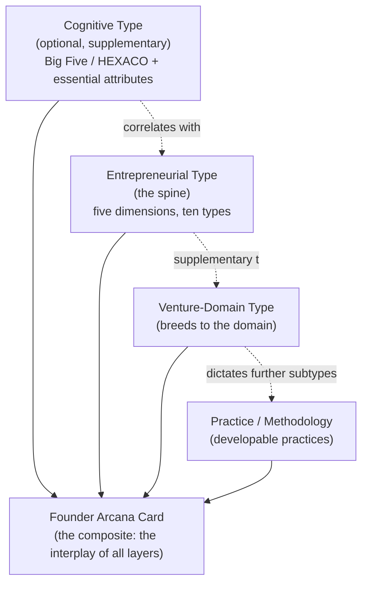

import MarginNote from '@/components/paged/MarginNote.astro';
import FootNote from '@/components/paged/FootNote.astro';
import InlineNote from '@/components/paged/InlineNote.astro';
import RoughAnnotation from '@/components/annotations/RoughAnnotation.astro';

The **Founder Arcana™** is a composable model of entrepreneurial identity. It describes founders, entrepreneurs, and innovators along five independent dimensions, and it resolves those dimensions into ten recognisable **entrepreneur-innovator types**. A type is a dominant tendency, useful because it predicts real things: how a founder builds, what they build well, which venture stage suits them, and who they need beside them to thrive.

<RoughAnnotation type="highlight" color="green">A founder is described by the interplay of several layers, not by a single label. The insight comes from reading the layers together.</RoughAnnotation>

The two tables that follow are the core of the system. The first defines the five dimensions along which founders differ. The second is the Founder Arcana itself: the ten types and their positions across those five dimensions. Everything after them explains how to read the model and put it to work.

## The Five Dimensions of the Founder Arcana

Each dimension is a spectrum along which founders genuinely differ. Each is reasonably independent of the others, grounded in the entrepreneurship literature, and operationally predictive: it changes team fit, venture-stage suitability, or the roles a founder needs around her. These five are the columns of the type table below.

| Dimension | Spectrum | What it captures | Why it matters |
|-----------|----------|------------------|----------------|
| **Logic** | Effectuation to Causation | How the founder reasons under uncertainty: from available means and emergent goals (effectuation), or from a fixed goal and assembled means (causation) | Predicts how a founder makes bets, and which co-founder logic complements hers |
| **Scope** | Operator to System Builder | Whether the founder pours into one venture deeply or designs portfolios, platforms, and ecosystems of ventures | Predicts whether she builds a company or an ecosystem, and the leverage she seeks |
| **Phase** | Originator to Scaler | Where in the venture lifecycle she is most alive: the 0-to-1 search for fit, or the post-fit build of teams and process | Predicts venture-stage fit and the single most common founder-venture mismatch |
| **Wealth-Generation** | Capability Builder to Asset Holder to Ecosystem-Wealth Weaver | Her theory of how durable wealth is created: by building the operating business, owning the underlying assets, or weaving regenerative ecosystem value | Predicts governance needs, capital stance, and exit-structure fit |
| **Domain Depth** | Narrow-Deep to Cross-Domain | The structure of her knowledge: mastery concentrated in one field, or synthesis across several | Predicts which opportunities she can even perceive, and where her competitive edge lies |

The full grounding for each dimension appears in the section below the type table. "Variable" in the type table marks a dimension that floats across individuals of that type.

## The Founder Arcana: Ten Entrepreneur-Innovator Types

| Type | Logic | Scope | Phase | Wealth-Generation | Domain Depth | In one line |
|------|-------|-------|-------|-------------------|--------------|-------------|
| **Signal-Reader** | Effectuation | Variable | Originator | Variable | Cross-Domain | Sees the venture before anyone else does |
| **Deep Operator** | Causation | Operator | Scaler-lean | Asset Holder | Variable | Master builder of one great thing |
| **Scale Commander** | Causation | Operator to System | Scaler | Capability Builder | Variable | Arrives post-fit and builds the operation |
| **Systems Architect** | Causation | System Builder | Scaler-lean | Capability Builder | Cross-Domain | Designs the platform others build on |
| **Serial Originator** | Effectuation | System Builder | Originator | Capability Builder | Variable | Founds, seeds, and moves on |
| **Convergence Builder** | Effectuation | System Builder | Variable | Ecosystem-Wealth | Cross-Domain | Builds at the intersection and tends it |
| **Domain Master** | Causation | Operator | Variable | Asset Holder | Narrow-Deep | Depth is the moat |
| **Governance Steward** | Causation | Operator | Scaler | Asset Holder | Variable | Guards equity, governance, and mission memory |
| **Capital Steward** | Causation | Variable | Scaler-lean | Capability Builder | Variable | Makes the capital work |
| **Mission Driver** | Effectuation | Variable | Originator-lean | Ecosystem-Wealth | Variable | Builds movements, not only companies |

## The Composable System

The Founder Arcana is a stack of layers. Each layer answers a different question, each is grounded differently, and each is optional to a different degree. A founder is the composite.

| Layer | What it captures | Optionality |
|-------|-----------------|-------------|
| **Cognitive Type** | The person's psychological profile, independent of entrepreneurial context | Optional; tracked separately for founders who want it |
| **Entrepreneurial Type** | How the person thinks and acts in entrepreneurial pursuits | The spine; the ten types |
| **Venture-Domain Type** | The kind of venture and domain the founder builds into | Sub-identity per domain; extensible |
| **Practice / Methodology** | The processes and methodologies the founder develops as practice | Tracked and developable |

The **cognitive layer** is where the essential attributes live, alongside established personality science.<FootNote n={1} color="burgundy" note="Cognitive substrate: the psychological profile beneath entrepreneurial behaviour. Measured with validated public instruments (Big Five, HEXACO) rather than a bespoke test. It correlates with entrepreneurial type without determining it.">The cognitive substrate</FootNote> It uses validated public instruments rather than a bespoke test.<MarginNote n={1} label="Zhao & Seibert, 2006" color="blue" note="Zhao, H., & Seibert, S. E. (2006). The Big Five personality dimensions and entrepreneurial status: A meta-analytical review. Journal of Applied Psychology, 91(2), 259-271. Entrepreneurs score higher on openness and conscientiousness than managers.">Personality-trait research</MarginNote> establishes real but modest associations between traits and entrepreneurial outcomes, which is why the cognitive layer supplements the model instead of defining it.

Three commitments make this model distinct. It contributes its **own naming series** for the ten types, its **own mappings** of how those types interact with established theory, and its **own practitioner heuristics** built from research rather than borrowed from folk taxonomies.

## The Five Dimensions in Full

The summary table above gives the spectra at a glance. This section grounds each dimension in the entrepreneurship literature and shows how it discriminates between founders.

### Entrepreneurial Logic: Effectuation to Causation

The founder's default reasoning under uncertainty. **Effectuation** starts from available means (who I am, what I know, whom I know), treats contingency as a resource, and lets goals emerge from co-creation.<FootNote n={2} color="burgundy" note="Effectuation: a means-driven logic. The entrepreneur begins with her resources and identity, sets an affordable-loss threshold, and allows the goal to emerge. Contrast with causation, which begins with a fixed goal.">Effectuation</FootNote> **Causation** starts from a defined goal and assembles the means to reach it.<MarginNote n={2} label="Sarasvathy, 2001" color="blue" note="Sarasvathy, S. D. (2001). Causation and effectuation: Toward a theoretical shift from economic inevitability to entrepreneurial contingency. Academy of Management Review, 26(2), 243-263. Derived from think-aloud protocols with 27 expert founders.">The distinction</MarginNote> emerged from studies of expert founders, who reason from affordable loss rather than expected return. A founder who launches from her own network and lets the product find its shape sits at the effectuation pole; a founder who models a target market and builds toward it sits at causation.

### Venture Scope: Operator to System Builder

Whether the founder's energy centres on building one venture deeply (**Operator**) or on designing portfolios, platforms, and ecosystems of ventures (**System Builder**). This is an orientation to scale and complexity, distinct from raw competence.<MarginNote n={3} label="Wasserman, 2012" color="blue" note="Wasserman, N. (2012). The Founder's Dilemmas. Princeton University Press. Longitudinal data on more than 10,000 founders, grounding founder-role orientation.">Wasserman's founder data</MarginNote> and Bhidé's venture taxonomy<MarginNote n={4} label="Bhidé, 2000" color="blue" note="Bhidé, A. V. (2000). The Origin and Evolution of New Businesses. Oxford University Press. Argues that venture type determines which founder profile succeeds.">both show</MarginNote> that different venture types demand different founder orientations. A founder who pours a lifetime into one company is an Operator; a founder who builds a studio that spins out many is a System Builder.

### Phase Primacy: Originator to Scaler

Where in the venture lifecycle the founder finds her deepest competence. **Originators** are most alive in the 0-to-1 phase: searching for product-market fit,<FootNote n={3} color="burgundy" note="Product-market fit (PMF): the point at which a venture has demonstrated that a defined market wants its product enough to sustain growth. The transition past PMF is where phase primacy becomes decisive.">product-market fit,</FootNote> discovering customers, building from nothing. **Scalers** are most effective post-fit: building teams, establishing process, capturing share.<MarginNote n={5} label="Blank, 2005; Ries, 2011" color="blue" note="Blank, S. (2005). The Four Steps to the Epiphany. Ries, E. (2011). The Lean Startup. Both distinguish the search phase from the execution phase as fundamentally different organisational modes.">The search phase differs</MarginNote> from the execution phase as an organisational mode, and few founders are equally at home in both. The distinction names a phase preference, not a ceiling on ability.

### Wealth-Generation Philosophy: Capability Builder to Asset Holder to Ecosystem-Wealth Weaver

The founder's theory of how durable wealth is created, and where she locates her own stake. This dimension reworks a classic finding.<MarginNote n={6} label="Wasserman, 2012" color="blue" note="Wasserman's rich-vs-king dilemma: founders trade financial return (rich) against control and autonomy (king). Retained here as the control-and-return facet within a broader three-pole philosophy.">The rich-versus-king dilemma</MarginNote> holds that founders trade financial return against control. The Founder Arcana keeps that facet and extends it into three orientations.

| Pole | Theory of wealth | Historical figure |
|------|-----------------|-------------------|
| **Capability Builder** | Wealth comes from building the businesses and capabilities that produce goods and services | The industrialist who builds the operating company |
| **Asset Holder** | Wealth compounds through owning the underlying assets on which capability is built | The landowner on whose ground the factory sits |
| **Ecosystem-Wealth Weaver** | New wealth is generated by cultivating regenerative, distributed value across an ecosystem | The founder pursuing shared, resilient value |

The three poles map a real historical debate.<FootNote n={4} color="burgundy" note="The three poles: Capability Builders earn by operating the business; Asset Holders compound by owning the substrate (land, IP, platforms, equity); Ecosystem-Wealth Weavers generate new value by cultivating a healthy ecosystem rather than extracting from a single asset.">The three wealth poles</FootNote> The capability builders who industrialised earned through operating businesses; the asset holders who owned where those capabilities were built amassed generational wealth through the substrate. The **Ecosystem-Wealth Weaver** names a third orientation, aligned with regenerative and coalitional value creation, that the older binary could not see.

### Domain Depth: Narrow-Deep to Cross-Domain

The structure of the founder's knowledge as it relates to opportunity. **Narrow-deep** founders concentrate mastery in one domain and compete on depth. **Cross-domain** founders synthesise across fields and compete on the opportunities visible only from multiple vantage points.<MarginNote n={7} label="Shane & Venkataraman, 2000" color="blue" note="Shane, S., & Venkataraman, S. (2000). The promise of entrepreneurship as a field of research. Academy of Management Review, 25(1), 217-226. Establishes that prior knowledge determines which opportunities an individual can perceive.">The individual-opportunity nexus</MarginNote> shows that prior knowledge determines which opportunities a person can even perceive. This makes Domain Depth the hinge between how a founder competes and which venture domains are reachable for her.

## The Ten Types

Each type is a recurring cluster in the five-dimensional space, defined by the two or three axes that most strongly characterise it. The named exemplars illustrate the type at its strongest; the blind spots describe the type's tendencies, not any individual's failings.

**Signal-Reader** (Effectuation, Originator, Cross-Domain). Reads signals in adjacent fields that specialists cannot see, and identifies opportunities early. Her ventures feel ahead of their time because they are. A founder such as **Reid Hoffman**, who read the shape of professional networking before the market existed, exemplifies the strength. Strengths: early non-obvious opportunity identification, comfort with radical uncertainty, cross-domain synthesis. Blind spots: difficulty shifting from discovery to execution, dispersed attention, underestimating operational infrastructure. Complements: Deep Operator, Scale Commander, Domain Master.

**Deep Operator** (Causation, Operator, Asset Holder). The operator's operator: she knows exactly what she is building and intends to run it herself for as long as it takes. **Brian Chesky's** decade-plus stewardship of a single company illustrates the mode. Strengths: deep operational ownership, high resilience, consistency. Blind spots: over-centralised decision-making, control-driven governance friction, optimising a venture rather than renewing it. Complements: Signal-Reader, Scale Commander, Convergence Builder.

**Scale Commander** (Causation, Scaler, Capability Builder). Takes a proven model and scales it with systematic vigour, comfortable accepting governance in exchange for the infrastructure to win. **Sheryl Sandberg's** scaling of an established platform is the archetypal expression. Strengths: systematic execution, team-building without cultural decay, governance fluency. Blind spots: poorly equipped for genuine 0-to-1 ambiguity, premature process, over-institutionalising. Complements: Signal-Reader, Serial Originator, Capital Steward.

**Systems Architect** (System Builder, Causation, Cross-Domain). Builds for leverage: infrastructure, platforms, and ecosystems that let other ventures operate. **Patrick Collison's** construction of payments infrastructure that others build upon exemplifies the type. Strengths: long-horizon systems thinking, platform economics literacy, cross-sector synthesis. Blind spots: over-engineering early products, chronic scope creep, designing systems no one inhabits. Complements: Deep Operator, Signal-Reader, Scale Commander.

**Serial Originator** (Effectuation, Originator, System Builder). Fulfilled by the founding act itself, repeated; her portfolio is a collection of firsts. The documented pattern of **Elon Musk**, who has originated across payments, automotive, aerospace, and infrastructure ventures, is a clear public record of this type's founding cadence, independent of any judgment on the ventures or the person. Strengths: extraordinary founding energy, compounding pattern recognition, psychological flexibility. Blind spots: moving on before scaling infrastructure is solid, under-investing in governance, forcing new contexts into familiar scripts. Complements: Scale Commander, Governance Steward, Capital Steward.

**Convergence Builder** (Cross-Domain, Effectuation, System Builder). The bridge-builder whose value is in the crossing, and the closest approximation of the [Key-Shaped Talent](/lexicon/key-shaped-talent) ideal.<MarginNote n={8} label="Cross-reference" color="teal" note="Key-Shaped Talent: depth in at least one domain plus genuine cross-domain fluency and whole-system thinking. The Convergence Builder approximates this profile.">She has depth in one domain</MarginNote> and genuine fluency across several, and she builds ventures that can only exist at the intersection. **Jensen Huang's** synthesis across chips, systems, and software illustrates the mode. Strengths: convergence-market opportunities specialists miss, cross-sector credibility, systemic leverage. Blind spots: shallow platforms when depth is thin, misread as unfocused, elegant problems nobody urgently needs. Complements: Domain Master, Deep Operator, Governance Steward.

**Domain Master** (Narrow-Deep, Causation, Operator). Competes on mastery so deep her products are difficult to replicate. **Jensen Huang** could sit here too; the clearer single-domain exemplar is a deep-technical founder such as **John Carmack**, whose competitive edge is unmatched depth. Strengths: defensible expertise, high product integrity, deep customer empathy within the domain. Blind spots: domain tunnel vision, over-engineering for quality, control-driven governance conflict as the venture outgrows her oversight. Complements: Convergence Builder, Scale Commander, Signal-Reader.

**Governance Steward** (Causation, Asset Holder mission-guardian, Operator). Remembers what the venture was for when growth creates incentives to drift; enforces clean cap tables and durable governance. A figure such as **Charlie Munger**, in the role of principled steward beside an operator, exemplifies the strength. Strengths: governance rigour, long-run mission orientation, institutional memory. Blind spots: braking legitimate pivots, blocking value-creating dilution, calcifying early decisions. Complements: Serial Originator, Signal-Reader, Deep Operator.

**Capital Steward** (Causation, Capability Builder, Scaler-lean). Thinks in unit economics, runway, and return profiles, and ensures the financial architecture matches the ambition. An investor-operator such as **Katherine Boyle** or a founding CFO mind exemplifies the discipline. Strengths: capital-efficiency discipline, investor-relations fluency, portfolio-level financial architecture. Blind spots: undervaluing qualitative signals, optimising metrics over product quality, premature optimisation of a product still in discovery. Complements: Signal-Reader, Deep Operator, Serial Originator.

**Mission Driver** (Effectuation, Ecosystem-Wealth Weaver, Originator-lean). Founds in defence of something; the venture is an act of advocacy or community service as much as a commercial proposition. **Yvon Chouinard's** mission-first stewardship of an environmental enterprise illustrates the type. Strengths: extraordinary community trust, mission clarity as strategic asset, resilience under adversity. Blind spots: mission purity blocking commercial pragmatism, governance friction with financial-first investors, diffuse coalition commitments. Complements: Scale Commander, Capital Steward, Governance Steward.

## How the Layers Interlink

The layers are **correlated, not one-to-one mapped**. This is the design commitment that separates the Founder Arcana from a flat personality test.

A cognitive tendency associates with an entrepreneurial type without fixing it. High openness, for example, associates with cross-domain and effectuation tendencies, yet two founders with the same cognitive profile can occupy different types. An entrepreneurial type is in turn supplementary to a venture-domain type: a Serial Originator expresses very differently in deep-tech than in creator media, and each domain carries its own language for the role. Practices attach on top of all of it, developed deliberately over a career.

Consider a worked reading. A founder scores as a **Signal-Reader** on the spine, shows high openness and moderate conscientiousness in the cognitive layer, and is building in a convergence domain (climate plus finance). The composite predicts more than the type alone: she will find the opportunity early and frame it well, her moderate conscientiousness suggests she can reach execution with support rather than resisting it, and the convergence domain means her natural cross-domain reading is an asset rather than a distraction. The recommendation writes itself: pair her with a Scale Commander before the scaling inflection, and give her a Governance Steward to hold the cap table while she reads signals.

<RoughAnnotation type="highlight" color="green">The value is the interplay. A type tells you who a founder is; the layers together tell you how to build around her.</RoughAnnotation>

## Applying Venture Time and Processes

The Founder Arcana earns its place by predicting operational decisions.

**Venture-stage fit.** Originator-primary types (Signal-Reader, Serial Originator, Mission Driver) are strongest before product-market fit. Scaler-primary types (Scale Commander, Capital Steward) are strongest after it. The most common and most explicable founding pair is a **Signal-Reader and a Deep Operator**: one reads the market and commits to affordable-loss entry, the other builds the operation and stays to run it. Each supplies what the other cannot self-generate.

**Complementary constellations.** Team composition becomes deliberate rather than accidental. A studio venture designed to outlast its founder benefits from a **Serial Originator, a Scale Commander, and a Governance Steward**: origination, scaling, and governance continuity across the handoff. A cross-sector fund benefits from a **Systems Architect, a Convergence Builder, and a Capital Steward**: portfolio design, cross-domain sourcing, and capital structure.

**The distress signal.** The single most predictive sign of founder-venture mismatch is an **Originator-primary founder running a scale-phase company**. A Signal-Reader or Serial Originator past product-market fit, with no Scale Commander beside her, is the pattern to check first. The intervention is a scaling complement or transition, and a strategy overhaul is secondary.

**The card as development instrument.** The composite renders as a Founder Arcana card that uses two further frameworks as overlays. [Key-Shaped Talent](/lexicon/key-shaped-talent) supplies the card's geometry, showing where the founder sits relative to the depth-plus-cross-domain ideal and which capabilities are underdeveloped. The [IMAGINE Framework](/lexicon/imagine-framework) supplies the attentional lens, showing how she allocates attention and where a development path would shift it. The dispositional type says who the founder is now; the geometry says what to grow; the attentional modes say how to direct effort to grow it.

## What Stays Open

The model is deliberately extensible, and several parts are still developing.

- **The cognitive instrument.** The cognitive layer currently references validated public personality inventories. A dedicated integration mapping cognitive facets to entrepreneurial types is future work.
- **The practice library.** The methodologies and techniques that attach to each type are being catalogued into a developable practice layer.
- **Domain and creator sub-arcanas.** The venture-domain layer is where domain-specific expressions attach. A forthcoming influencer-focused expression will translate the model for creator-economy founders and their self-onboarding.
- **The oracle deck.** A physical deck is in development as a facilitation instrument for ecosystem self-assessment.

A type is a tendency, not a destiny. Personality-trait predictors of entrepreneurial outcomes have modest effect sizes, so the Founder Arcana is best read as a map of dispositions and their development, never as a verdict on who can build.

## References

Bhidé, A. V. (2000). *The Origin and Evolution of New Businesses.* Oxford University Press.

Blank, S. (2005). *The Four Steps to the Epiphany.* K&S Ranch.

Frese, M., & Gielnik, M. M. (2014). The psychology of entrepreneurship. *Annual Review of Organizational Psychology and Organizational Behavior, 1,* 413-438.

Rauch, A., & Frese, M. (2007). Let's put the person back into entrepreneurship research: A meta-analysis on the relationship between business owners' personality traits, business creation, and success. *European Journal of Work and Organizational Psychology, 16*(4), 353-385.

Ries, E. (2011). *The Lean Startup.* Crown Business.

Sarasvathy, S. D. (2001). Causation and effectuation: Toward a theoretical shift from economic inevitability to entrepreneurial contingency. *Academy of Management Review, 26*(2), 243-263.

Shane, S., & Venkataraman, S. (2000). The promise of entrepreneurship as a field of research. *Academy of Management Review, 25*(1), 217-226.

Wasserman, N. (2012). *The Founder's Dilemmas: Anticipating and Avoiding the Pitfalls That Can Sink a Startup.* Princeton University Press.

Zhao, H., & Seibert, S. E. (2006). The Big Five personality dimensions and entrepreneurial status: A meta-analytical review. *Journal of Applied Psychology, 91*(2), 259-271.

## Cross-links

- [Key-Shaped Talent](/lexicon/key-shaped-talent)
- [IMAGINE Framework](/lexicon/imagine-framework)
- [Innovation Sanctuary](/lexicon/innovation-sanctuary)
- [CITAble Businesses](/lexicon/citable-businesses)
- [Innovation Ecosystem Archetypes and Roles](/posts/innovation-ecosystem-archetypes-and-roles)

## Origin and Homage

The name carries its own history. **Arcana** are the mysteries of the Tarot, knowledge that reveals itself only through study and reflection. The choice of word was deliberate: recurring founder patterns are visible across ecosystems and eras, yet recognising them in oneself and others takes work.

The earlier form of this idea drew on two sources. The first was Larry Smith's account of the essential attributes of innovators, developed over decades at the University of Waterloo's Problem Lab: <MarginNote n={9} label="Smith, Problem Lab" color="blue" note="Smith, L. Problem Lab Methodology. University of Waterloo, Centre for Business, Entrepreneurship and Technology. Identifies courage, patience, discipline, imagination, and passion as recurring attributes of high-performing innovators.">courage, patience, discipline, imagination, and passion.</MarginNote> The second was the founding philosophy of ancient Rome, read as a lesson in ecosystem design: a system that turned outsider energy into institutional strength by staying radically open to unconventional contributors. That origin is preserved in a companion essay for readers who want the fuller philosophical treatment.<MarginNote n={10} label="Cross-reference" color="teal" note="The origin essay covers the Larry Smith essential attributes and the Roma founding philosophy in depth.">See [Innovation Ecosystem Archetypes and Roles](/posts/innovation-ecosystem-archetypes-and-roles).</MarginNote>

The framework introduced here modernises that origin. The five essential attributes become part of the cognitive substrate that underlies the model rather than the model itself. The provisional roles of the earlier work (Zero-to-Seed Founders, Seed-to-VC Operators, Ecosystem Builders, Connectors, Mentors) are formalised and expanded into the ten types. The Roman naming is retired in favour of modern functional names that a contemporary founder can read without a glossary.
