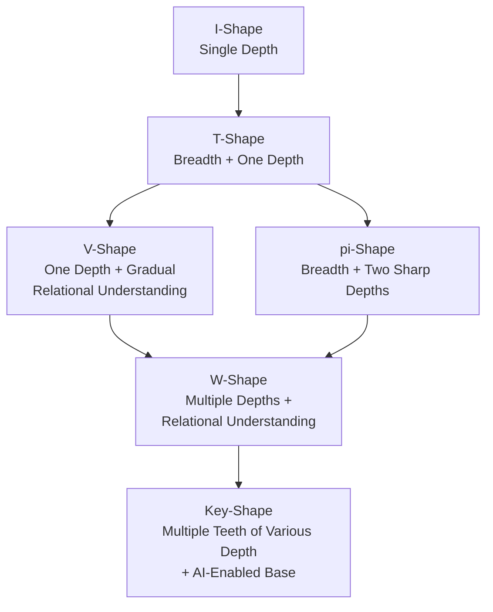

## Introduction

AI has raised the competence floor for everyone. When broad knowledge is accessible in minutes, the differentiator shifts to carving signal from noise across domains to develop genuine capability.

**Key-Shaped Talent™** visualises talent as a key: a wide base (AI-enabled competence available to all) with multiple teeth of varying depth (domains of genuine expertise). Each tooth represents capability, the application of knowledge in novel situations, not merely competence.

The model moves beyond the W-shape to accommodate the multiplicity of domains required for differentiation in complex systems.

## The Shape Evolution

Four talent shape models represent evolution in how we understand individual capability:

- **I-Shape**: Single domain specialist, effective in stable environments with well-defined problems.
  
- **T-Shape**: Breadth of general knowledge plus one domain of depth; enables cross-disciplinary collaboration.
  
Pi-Shape and V-Shape represent divergent paths beyond the T-shape foundation:

- **Pi-Shape**: Two sharp domains of depth alongside breadth foundation; addresses problems requiring synthesis across fields.
  
- **V-Shape**: One primary domain of depth with gradually deepening understanding of related fields; emphasizes relational ability.
  
- **W-Shape**: Multiple domains of depth plus gradual relational understanding; enables system-level thinking across complex problems.

**Key-Shape** expands beyond W for the AI era: multiple teeth of varying depth (more than two genuine expertise domains) combined with a wide AI-enabled base. The teeth represent genuine capability where AI provides competence at scale.

## Carving the Teeth

The key metaphor is precise: teeth are CARVED, not grown. The process is subtractive as much as additive. With AI providing a firehose of information, developing genuine expertise requires curating away noise to focus on what produces real capability.

Carving teeth requires three complementary practices:

- **Knowledge Curation and Stewardship**: the deliberate act of selecting, validating, connecting, and pruning knowledge. Treat knowledge as material to be shaped rather than content to be stored. Carving a tooth occurs through active construction: creating artifacts, testing predictions, and iterating understanding until the domain reveals its underlying structure.

- **Structured Reflection**: externalize tacit understanding to develop precision. Carve a tooth by repeatedly articulating, testing, and refining your understanding until you can apply it in novel situations (capability) rather than merely recall it within familiar contexts (competence). The teeth emerge from quality of engagement, not time spent.

- **Dynamic Equilibrium**: the number of teeth is deliberately unspecified. In an AI-augmented future, you will need more than a couple. The specific count depends on your chosen role, ecosystem needs, and how rapidly AI commoditizes domains. Teeth must be maintained, sharpened, and occasionally discarded as the terrain changes; carving is continuous.

## Connection to Innovation Ecosystems

Nova Roma references Key-Shaped Talent as the target profile for its Innovation Sanctuary programs. Innovation ecosystems require contributors who can:

- Operate with depth when a problem demands domain expertise (individual teeth)
- Shift to collaborative mode when execution requires coordination (the base enables communication)
- Make cross-domain connections that reveal opportunities invisible to single-domain experts
- Navigate complex systems where breakthroughs occur at the intersection of multiple fields

This functional profile describes what ecosystems need from contributors to operate effectively at boundaries between disciplines. The ecosystem requires sufficient variety and connectivity such that any given challenge finds at least one contributor whose configuration of teeth addresses its core complexity.

The base sustains shared understanding; the teeth produce distinctive contributions; the relationships between teeth enable synthesis. Key-Shape Talent appears most frequently in environments that deliberately foster boundary-spanning activity: innovation labs, research consortia, cross-industry task forces, and long-term scientific missions.

## Connection to AI-Native Work

In a Hybrid Intelligence operating model, Key-Shaped talent enables effective orchestration. An orchestrator overseeing agent fleets across multiple domains needs:

- Enough depth in each domain to evaluate agent output quality (the teeth)
- Enough breadth to coordinate across domains without bottlenecking (the base)
- Enough relational understanding to spot when an insight should trigger action in another domain

This profile is both an individual development model and an organizational design requirement. Innovation ecosystems and AI-native organizations both converge on needing this profile because they operate at the pace where AI generates solutions faster than human oversight can validate them.

**Organizational implications** follow:

- **Team composition**: roles requiring one specialist now require teams with individuals each possessing multiple teeth. The collective shape matters more than any individual's configuration.

- **Hiring**: shift toward pattern recognition—identifying individuals whose arrangement of teeth connects with and enhances the existing team configuration.

- **Organization design**: environments where multiple domains can be cultivated, curation practices shared, and reflection made communal. Talent architecture and organizational architecture exist in tight coupling, continuously adapting together.

## References

- Barile, Nick. "T-Shaped Professionals." *Design Management Journal* 14, no. 4 (2003). The foundational articulation of breadth plus depth as a talent model.

- Hase, Stewart, and Chris Kenyon. "From Andragogy to Heutagogy." *UltiBase Articles* (2000). Self-determined learning theory distinguishing competence from capability.

- Guest, David. "The Hunt Is On for the Renaissance Man of Computing." *The Independent*, September 17, 1991. Early articulation of the T-shaped ideal in technology.

## Cross-links

- [Hybrid Intelligence](/lexicon/hybrid-intelligence)
- [Innovation Sanctuary](/lexicon/innovation-sanctuary)
- [Knowledge Curation and Stewardship](/lexicon/knowledge-curation)
- [Organisational Design as Code](/lexicon/organisational-design-as-code)
- [Strategy Map](/lexicon/strategy-map)
- [Structured Reflection](/lexicon/structured-reflection)
