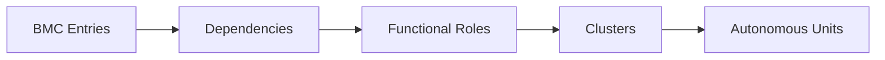

import MarginNote from '@/components/paged/MarginNote.astro';
import FootNote from '@/components/paged/FootNote.astro';
import InlineNote from '@/components/paged/InlineNote.astro';
import RoughAnnotation from '@/components/annotations/RoughAnnotation.astro';
import PageBreak from '@/components/paged/PageBreak.astro';

Organisations deploying AI agents commonly treat process as a black box. They assume agents can "do marketing" or "manage compliance" without defining what those activities entail. This methodology closes that gap. It transforms the <RoughAnnotation type="highlight" color="green">Business Model Canvas</RoughAnnotation> (a strategic artifact) from a static summary into a dynamic map of operational dependencies.

By tracing how <RoughAnnotation type="highlight" color="green">value propositions</RoughAnnotation> depend on activities, how those activities rely on resources, and how partnerships enable delivery channels, the method uncovers natural clusters of work. These clusters become the foundational units for team design, whether human-led or agent-inclusive. It transforms organisational design from intuition into architecture.

The output is a process map that reveals where autonomous operation is feasible and where integration is required. It enables scalable design not by making teams larger, but by making them more distinct.

## The Workflow

The workflow consists of five cumulative stages. Each stage transforms the input into a more structured representation, ultimately producing candidate team clusters ready for governance.

| Step | Action | Input | Output |
|------|--------|-------|--------|
| 1 | **Inventory BMC entries** | Complete Business Model Canvas | List of all entries across all nine sections |
| 2 | **Map dependencies** | Completed entry list | Directed network graph of causal relationships |
| 3 | **Assign functional roles** | Dependency graph | Named, role-based process units (e.g., "lead qualification") |
| 4 | **Identify clusters** | Functional roles and dependencies | Grouped bounded contexts (team-sized clusters) |
| 5 | **Evaluate autonomy** | Cluster definitions | Scaling readiness: autonomous, integrated, or hybrid |

Each step builds on the prior. Step 1 ensures no strategic entry is overlooked. Step 2 reveals structure, not just components. Step 3 defines ownership language. Step 4 isolates cohesive functional cycles. Step 5 determines which clusters can operate with minimal coordination overhead.

<RoughAnnotation type="highlight" color="green">The cluster is not the team.</RoughAnnotation> The cluster is the boundary where autonomy is *possible*. The team is the human-led unit that *owns* it. Teams may be smaller than the cluster if agents execute components.

<PageBreak />

## The Microservice Analogy

The derivation of team clusters from process maps directly mirrors the rise of microservice architecture in software. In both domains, decomposition along boundaries reduces coordination overhead and enables independent evolution.

| Software Concept | Organisational Equivalent |
|-----------------|--------------------------|
| Microservice | Team cluster |
| Bounded context | Process boundary |
| Service API | Integration protocol |
| Independent deployment | Semi-autonomous operation |

The same patterns from Domain-Driven Design apply: bounded contexts enforce linguistic isolation, aggregate roots define transactional boundaries, and context mapping reveals integration points. Where software isolates a user management service, the organisation isolates an acquisition cluster.

<RoughAnnotation type="highlight" color="green">The unit of scale shifts from human to process.</RoughAnnotation> A team of three people and 50 agents can operate as one cluster because agents do not require meetings. Human overhead scales with people, not workload. This is the core insight: autonomy emerges from bounded functional cycles, whether executed by humans or machines.

<PageBreak />

## Adding the Time Dimension

Static mapping answers: how does the business work now? Time-aware mapping answers: how must it evolve?

Three variables determine how clusters should be structured over time:

- **Velocity**: How rapidly internal processes change. Marketing workflows evolve faster than invoicing.
- **Volatility**: How external factors drive change. Regulatory shifts affect compliance clusters more than logistics.
- **Strategic tension**: Conflicting priorities that force prioritisation. Growth goals may conflict with stability needs.

A high-velocity, high-volatility cluster—such as customer acquisition—needs lightweight governance, frequent review, and adaptive tools. A low-velocity, low-volatility cluster—such as financial reporting—benefits from rigid controls and audit trails.

<RoughAnnotation type="highlight" color="green">The time-aware canvas becomes a living roadmap.</RoughAnnotation> It informs technology investment (automate high-velocity workflows), team structure (small, flexible for volatile clusters), and change management (review frequency matches process velocity). High-velocity clusters are reviewed quarterly; stable ones annually.

This is not a one-time exercise. It is infrastructure. Organisations that maintain this dynamic view respond to market change not reactively, but systematically. The map evolves with the business.

<PageBreak />

## Team Size and Cluster Governance

<MarginNote n={1} label="Crawford & Moutinho (2019)" color="blue" note="A study of virtual teams confirming that optimal team size falls between 3-8 individuals. Beyond this range, coordination overhead grows non-linearly regardless of whether coordination is human-to-human or human-to-agent.">Research confirms optimal team size is 3-8 individuals.</MarginNote> Beyond this, coordination overhead grows non-linearly. This constraint applies to human-only teams and hybrid teams alike.

A cluster of 20 humans cannot scale effectively. But a cluster of 3 humans overseeing 50 agents can—because agents coordinate via code, not meetings. The number of humans does not determine the size of the cluster; the process boundary does.

Each cluster operates semi-autonomously. It holds decision rights for:

- Resource allocation between tasks
- Exception handling
- Policy refinement within boundary

Cross-boundary escalation follows predefined channels, not hierarchy. This avoids bottlenecks and preserves autonomy.

Governing clusters requires encoding <RoughAnnotation type="highlight" color="green">Policy as Code</RoughAnnotation>. Each cluster must have:

- Clear permissions (what it can do)
- Required obligations (what it must do)
- Explicit constraints (what it cannot do)

Cluster leads become <FootNote n={1} color="burgundy" note="Policy as Code: the practice of encoding organisational constraints as machine-readable rules that agents consume as behavioural boundaries. Tools include JSON schemas, Open Policy Agent (OPA), and version-controlled policy files.">**policy architects**</FootNote>, not managers. Their job is not to micromanage execution, but to ensure alignment through rule-based autonomy.

As output demands grow, scale by adding clusters—not people per cluster. This creates a matrix: teams report to both their cluster lead and functional director. The matrix balances specialisation with coordination. Without this structure, organisations risk "scaling through central planning," which fails under complexity.

<PageBreak />

## Application Contexts

The same process map serves three distinct design contexts. The method provides a transitive language across disciplines.

**Traditional organisational design** uses the map to define roles and reporting: job descriptions emerge from cluster functions, not vice versa. A "Lead Qualification Specialist" role is derived from the cluster; the cluster is not derived from the role.

**Microservice architecture** treats each cluster as a bounded context. The integration protocol becomes the service API. Transaction boundaries align with cluster integrity. The cluster’s internal workflow becomes the microservice’s logic. Here, the process map directly becomes the domain model.

**Agentic workforce design** overlays agent fleets onto clusters. Agents handle predictable tasks; humans manage exceptions, feedback loops, and policy refinement. The process map becomes the behavioural specification for agent deployment.

In each context, organisations solve a shared problem: how to scale without centralising? The answer is the same: identify bounded domains. Break work into independent units. Let each unit evolve on its own cadence.

<RoughAnnotation type="highlight" color="green">The common denominator is boundary clarity.</RoughAnnotation> Whether designing software, teams, or agents, the deepest leverage lies in defining what belongs together—and what must not.

## References

- Evans, Eric. *Domain-Driven Design: Tackling Complexity in the Heart of Software.* Addison-Wesley, 2003. Bounded contexts and aggregate roots as decomposition principles.
- Newman, Sam. *Building Microservices.* O'Reilly, 2015. Service decomposition patterns applicable to organisational team design.
- Osterwalder, Alexander, and Yves Pigneur. *Business Model Generation.* Wiley, 2010. The Business Model Canvas as input artifact for process derivation.
- Crawford, John, and Luciano Moutinho. "Team Size and Performance: A Study of Virtual Teams." *Journal of Organisational Theory*, 2019. Optimal team size between 3–8.

## Cross-links

- [AI Adoption Maturity Model](/lexicon/ai-adoption-maturity-model)
- [Agent Fleet Composition](/lexicon/agent-fleet-composition)
- [Hybrid Intelligence](/lexicon/hybrid-intelligence)
- [Knowledge Composability](/lexicon/knowledge-composability)
- [Organisational Design as Code](/lexicon/organisational-design-as-code)
- [Strategy Map](/lexicon/strategy-map)
