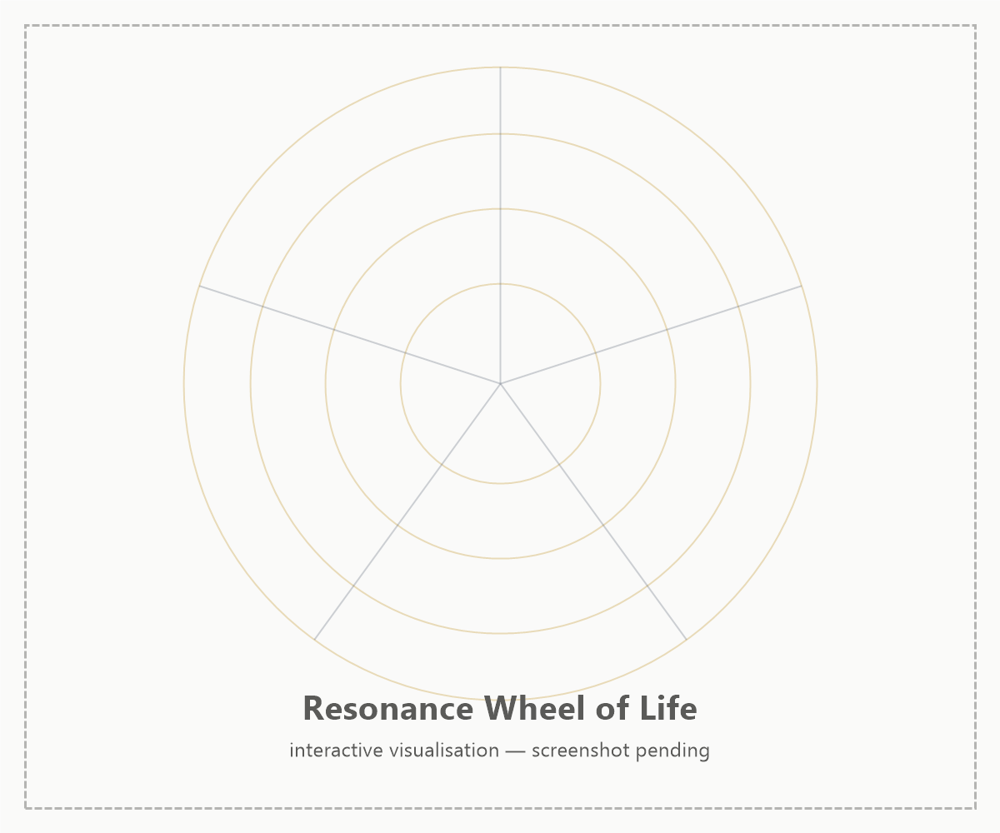

import MarginNote from '@/components/paged/MarginNote.astro';
import FootNote from '@/components/paged/FootNote.astro';
import InlineNote from '@/components/paged/InlineNote.astro';
import RoughAnnotation from '@/components/annotations/RoughAnnotation.astro';

Most life-design tools ask how you feel. Rate your health from one to ten. Score your career, your relationships, your sense of spiritual peace. The classic Wheel of Life renders those scores as spokes and shows you where the wheel runs flat. It is a satisfaction survey wearing the costume of a diagnostic.

The trouble is that a feeling is an output, not a lever. Knowing you are a four out of ten on "health" tells you nothing about which input produced the four or which input would move it. And treating each spoke as its own independent dial hides the fact that a gain in one domain routinely pays for itself, or bankrupts itself, somewhere else on the wheel.

<RoughAnnotation type="highlight" color="green">The Resonance Wheel of Life™ reengineers the classic wheel along two axes: it measures the structural inputs driving each domain instead of passive states, and it maps the active interdependencies between domains rather than pretending they are separable.</RoughAnnotation>

The five categories carry a memory hook, **VCARD**: Vitality, Cognition, Abundance, Relations, Direction. The full two-word names below are the canonical ones; the hook is for recall.

## From Wheel of Life to Resonance Wheel of Life

The lineage is deliberate. In [Finding Direction](/posts/finding-direction), a survey of fifteen life-design frameworks, the Wheel of Life appears as a Tier 1 categorical tool: rate satisfaction across eight to ten domains, look for the flat spot. Its value is scope. Its two structural weaknesses are the reasons this adaptation exists.

<MarginNote n={1} label="The balance fallacy" color="orange" note="Finding Direction identifies the Wheel of Life's embedded 'balance fallacy': the assumption that equal satisfaction across all categories is optimal. Research on flow and purpose suggests asymmetric investment often produces higher wellbeing than balanced mediocrity. The Resonance Wheel of Life keeps the categorical scope but abandons the balance target.">First, the Wheel of Life measures passive states.</MarginNote> It asks how satisfied you are, which is a report on the past, not a specification you can act on. Second, it embeds a balance fallacy: it implies that an even, fully-inflated wheel is the goal, when asymmetric investment in the right domains often produces more of a directed life than balanced mediocrity.

The Resonance Wheel of Life keeps what the classic wheel does well and changes what it does poorly:

| Property | Wheel of Life | Resonance Wheel of Life |
|----------|---------------|-------------------------|
| Unit of measure | Felt satisfaction (output) | Structural inputs (levers) |
| Domain relationship | Independent spokes | Coupled dimensions, resonance mapped |
| Implicit goal | Balance (all spokes equal) | Directed asymmetry (invest where it compounds) |
| Visualisation | Static radar | Radar snapshot **plus** Resonance Wheel of interactions |

It inherits the categorical breadth of the original and layers on the systems-thinking property that Finding Direction found missing from every Tier 1 framework: an explicit model of how the domains interact.

## The Five Categories

Each category is a two-word name pairing a domain with the active stewardship it demands. Each decomposes into two minor dimensions scored from 0 to 100.

### Physical Vitality

Traditional wheels fold "Health" and "Environment" into passive scores. Physical Vitality demands active stewardship of both the body and its physical surroundings.

- **Functional Health**: adherence to active conditioning protocols rather than a generic wellness feeling. Tracks concrete inputs such as whole-food plant-based nutrition and contrast hydrotherapy routines.
- **Habitat Design**: the deliberate optimisation of your physical environment rather than treating it as a static backdrop. Quantifies activities such as maintaining permaculture guilds and installing solar-powered aeration on private land.

### Cognitive Capital

Popular frameworks split "Career" from "Personal Growth," creating an artificial divide between learning and doing. <FootNote n={1} color="burgundy" note="Cognitive Capital replaces the working label 'Cognitive Architecture.' Capital captures the intended meaning better: knowledge is an asset that compounds when systematised and yields return when deployed. It also pairs cleanly with Perceived Abundance later on the wheel.">Cognitive Capital treats knowledge as an asset that compounds when systematised and pays out when deployed.</FootNote>

- **Structural Knowledge**: the maintenance of a personal knowledge system, advancing passive learning into active systematisation. Evaluates how effectively you process insight through tools such as Obsidian vaults and Zettelkasten workflows.
- **Professional Execution**: the direct application of that knowledge to market problems. Tracks the deployment of cloud infrastructure and data pipelines toward strategic professional outcomes.

### Perceived Abundance

Standard designs scatter qualitative satisfaction across every domain. Perceived Abundance isolates the subjective sense of enough, pairing financial capital with unstructured play.

- **Financial Capital Allocation**: self-perceived financial security. Evaluates your satisfaction with liquid assets and long-term capital investments rather than raw net worth.
- **Unstructured Recreation**: the deliberate counterweight to the other nine dimensions. Where they frame activity as an input for future growth, this one measures time spent entirely for immediate enjoyment, with no attached goal or expected output.

### Relational Resonance

Standard wheels bucket relationships by proximity, clustering friends and family together. Relational Resonance sorts connections by function and depth.

- **Core Bonds**: the immediate partnerships. Assesses the depth of trust and directness of communication with life partners.
- **Social Impact**: structural contribution to groups beyond the inner circle, replacing the generic "Community" score. Tracks active mentorship and legacy-preservation work.

### Existential Direction

Conventional models use "Spirituality" to gesture at inner peace. The term is vague and resists measurement. Existential Direction grounds the abstract in structured practice and forward-looking strategy.

- **Internal Coherence**: baseline self-respect and the consistency of reflective practice. Tracks the use of reflective tools such as oracle-card spreads to hold internal alignment.
- **Strategic Foresight**: long-term vision made operational. Measures how well daily action aligns with multi-horizon planning and projected future scenarios.

## Why a Wheel, Not Just a Radar

Scoring ten dimensions out of 100 and plotting them on a radar produces an immediate snapshot. It also produces the [Resonance Wheel](/lexicon/resonance-wheel)'s central objection: a radar chart quietly implies each dimension is an independent, separately tuneable dial. In a life, that is false.

The dimensions couple. A gain in one routinely amplifies or taxes another, and the most consequential of these interactions are invisible on a radar:

- **Functional Health amplifies Cognitive Capital.** Sleep, conditioning, and nutrition set the ceiling on the cognitive work that Structural Knowledge and Professional Execution depend on. Neglect the first and the second erodes regardless of effort.
- **Professional Execution and Unstructured Recreation trade off.** Every hour deployed against a market problem is an hour not spent in goalless play. Pushing execution to its maximum quietly zeroes out the one dimension that exists as a counterweight, and the wheel hollows even as the "career" score climbs.
- **Strategic Foresight cascades into Financial Capital Allocation and Habitat Design.** Multi-horizon planning changes how you allocate capital and what you build into your physical surroundings; a shift in Direction propagates outward across the wheel.

<MarginNote n={2} label="Scoring and cadence" color="blue" note="Each dimension scores 0 to 100. The radar answers 'what is the current shape?' and the Resonance Wheel answers 'what happens if I try to change it?' Finding Direction warns that frameworks with high review costs decay fastest, so the intended cadence is light: a periodic re-score, not a quarterly rewrite.">The Resonance Wheel of Life pairs the radar with a wheel for exactly this reason.</MarginNote> The radar shows the current shape at a glance. The wheel shows which dimensions move together, so an intervention aimed at one domain accounts for what it will do to the others. The goal is not a fully inflated, perfectly balanced circle. The goal is directed asymmetry: investment concentrated where it compounds across the wheel.

**Figure 1:** The Resonance Wheel of Life with its ten dimensions scored on the radar and the interdependencies between them drawn as connecting chords (illustrative; interactive version rendered from the FW.VISION visualisation toolkit).

## How to Use It

Score each of the ten dimensions from 0 to 100 on inputs, not feelings: not "how healthy do I feel" but "am I holding the conditioning protocol." Read the radar for the current shape, then read the wheel for the couplings before choosing where to intervene. A high Functional Health score is not an end state; it is fuel for Cognitive Capital, and the wheel makes that dependency legible.

Re-score on a light cadence. The most elaborate life plans decay fastest because they cost too much to maintain, so the Resonance Wheel of Life is built to be re-run in an afternoon rather than rewritten over a weekend. The instrument earns its place only if you actually return to it.

## Related

- [Resonance Wheel](/lexicon/resonance-wheel)
- [Finding Direction: Reflections on a Survey of Life Design Frameworks](/posts/finding-direction)
- [Cognitive Vitality Index](/lexicon/cognitive-vitality-index)
