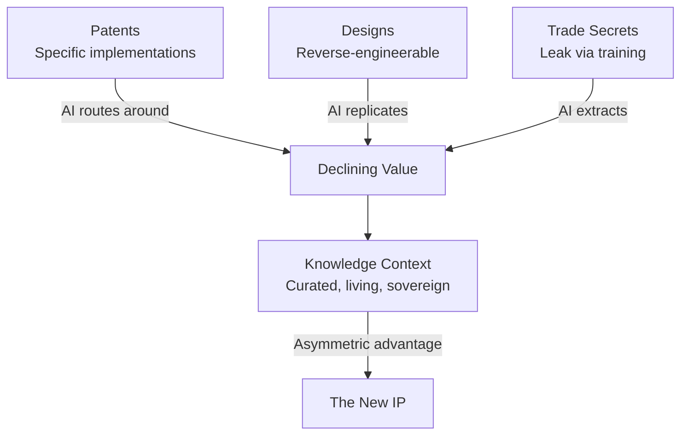

## Introduction

Traditional intellectual property (patents, designs, trade secrets) is losing its protective power. Patents safeguard specific implementations; AI generates viable alternatives. Designs are reverse-engineered from photographs in hours. Trade secrets leak through training data extraction. The barrier to creation has collapsed. What once took years now takes minutes.

The shift is structural: from "IP as legal protection" to "IP as contextual knowledge and data" (Horatio Morgan, University of Waterloo, 2026). What replaces patents, designs, and trade secrets as the economic moat? **Knowledge Context**: the curated, living, domain-specific understanding that makes an agent (human or AI) effective in a specific environment.

## The Collapse of Traditional IP

**Patents**, designed to incentivise innovation by granting time-limited exclusivity, now falter when AI circumvents protected claims with novel architectures. Litigation cycles lag behind market adoption. By the time a patent is enforced, the value has shifted.

**Designs**, once the domain of skilled industrial teams, are now reconstructed from visual data using generative models. Reverse-engineering, once costly and slow, is now automated and near-instantaneous.

**Trade secrets**, reliant on secrecy, are compromised when proprietary processes serve as training data for foundation models. The knowledge doesn’t vanish; it diffuses into the weights of models accessible to anyone with access.

The asymmetry IP was meant to protect (years of R&D investment) is now irrelevant. The marginal cost of replication has plummeted to near zero. Boldrin & Levine (*Against Intellectual Monopoly*, 2008) foresaw this: IP has always restricted innovation more than it enabled it. AI makes that tension visible.

## Knowledge Context as the New IP

**Knowledge Context** is the curated, living, domain-specific understanding that enables action. It includes:

- **In-context application insights**: Knowing when and where to apply knowledge, not just what it is.
- **Domain-specific datasets**: Proprietary training material refined by real-world feedback.
- **Real-world validation**: Theory tested, iterated, and adapted through practice.
- **Network effects**: Value grows with connections; the more agents operate within the same context, the richer it becomes.

It cannot be easily replicated because:

- It is accumulated through lived experience and structured reflection.
- It is inseparable from the judgment that produced it.
- It is dynamic; static snapshots lose value rapidly.
- It is contextual; effective only within the relationships that produced it.

**Choke points** define value in an agentic economy (Morgan, 2026). Control the critical path, not the product. Apple owns ecosystem context, not hardware manufacturing. Netflix owns viewership context, not studios. Careem controlled driver-onboarding context in the Middle East, making acquisition difficult for Uber. The choke point in AI-native work is not the model; it is the context that makes the model effective.

## The Ownership Distortion

Those closest to value creation often own least (Morgan, 2026):

- **Founders** hold equity but may lack operational control over context.
- **Employees** generate the most valuable context but own no stake in it.
- **Customers** generate data and usage patterns that improve systems, yet retain nothing.

This distortion applies directly to Knowledge Context. Domain experts produce its core, yet organisations extract it into training data, retain it after departure, and sell it without compensation. This connects directly to **Digital Sovereignty and Work Twins**: the sovereign model inverts this by asserting context belongs to its creator, not its extractor.

## The Information Monopoly Risk: Gresham's Law for Context

Larry Smith warns (University of Waterloo Problem Lab, 2026): companies hoarding proprietary context create new oligarchies. Medieval guilds monopolised knowledge within bloodlines. Modern AI firms are the new guilds, with proprietary training data as inherited advantage.

The **Hoarder's Incentive** is rational: experts fear training AI that replaces them. The response is to withhold their deepest insights. This creates a self-fulfilling dynamic toward monopolisation.

**Gresham's Law for information**: when good context is hoarded, the public commons fills with noise. Bad context drives out good context. Collective intelligence degrades. The gap widens between context-rich insiders (those with proprietary training) and context-poor outsiders reliant on degraded public data.

**Multi-generational risk**: Unlike patents, which expire, context monopolies compound. Each generation’s proprietary context trains the next generation’s AI. Advantage accumulates invisibly across decades.

## Protection Without Traditional IP: Zero-Knowledge Proofs

If traditional IP fails, how is Knowledge Context protected? Zero-knowledge proofs offer a complementary approach:

- Prove knowledge exists without revealing it.
- Verify compliance without full disclosure.
- License usage without sharing secrets.
- Enable verifiable provenance via blockchain.

Use cases:

- Prove domain expertise without exposing training data.
- Verify an agent was trained on legitimate context, not stolen.
- License context with cryptographic accountability.

This aligns with the [Digital Sovereignty](/lexicon/digital-sovereignty-and-work-twins) exploration of blockchain-based tracking for "context usage" rather than "hours billed."

## The Perpetual Context Challenge

From *Bibliotheca Futurae*:

> How might we establish a Perpetual Context that ensures institutional wisdom survives the departure of key experts, without creating a surveillance culture that destroys psychological safety, and without punishing experts for training the very AI that might replace them?

The tension is architectural: organisations need context continuity, but individuals must own sovereign context.

Possible resolution: voluntary contribution with royalty models. Experts share context willingly when the economic model rewards perpetual value. This links back to the [Digital Sovereignty](/lexicon/digital-sovereignty-and-work-twins) convertible note and royalty employment models. The system must make contribution more attractive than hoarding; not through mandate, but through incentive design.

## Cross-links

- [Digital Sovereignty and Work Twins](/lexicon/digital-sovereignty-and-work-twins)
- [Knowledge Composability](/lexicon/knowledge-composability)
- [Knowledge Curation and Stewardship](/lexicon/knowledge-curation)
- [Perceptiosphere](/lexicon/perceptiosphere)
- [Structured Reflection](/lexicon/structured-reflection)

## References

- Boldrin, Michele & Levine, David K. *Against Intellectual Monopoly.* Cambridge University Press, 2008.
- Lessig, Lawrence. *Free Culture.* Penguin, 2004.
- Morgan, Horatio. Discussions on asymmetric advantage, choke points, and IP as contextual data. University of Waterloo, 2026.
- Smith, Larry. Problem Lab discussions on information monopoly and innovator incentives. University of Waterloo, 2026.
- Wang, Francis. "Digital Sovereignty and Work Twins." Lexicon entry. findcongwang.com, 2026.