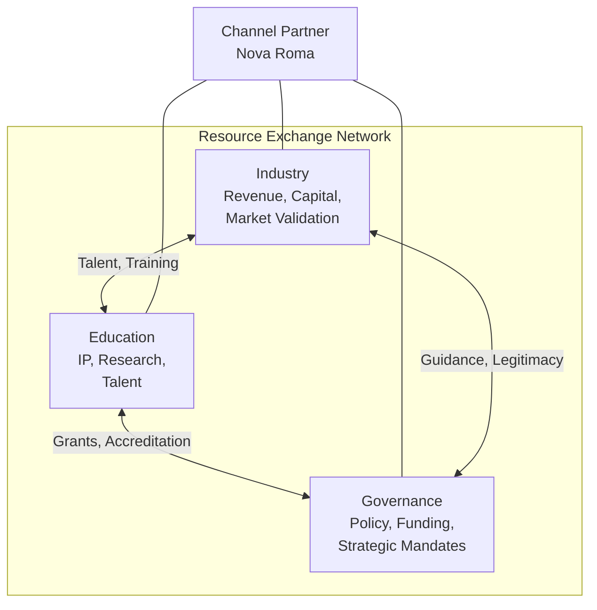

## Introduction

Durable innovation requires industry, governance, and education acting in concert. Each sector operates with different incentives, timelines, and outputs. The Tripartite Ecosystem Model provides the structural framework for understanding how these sectors interact and trade resources. Each sector's outputs are another sector's desired inputs. The ecosystem functions as a trade network. The more frequent and complex these exchanges become, the more resilient the system. This model was developed independently and later found to parallel the Triple Helix framework (Etzkowitz & Leydesdorff, 2000). The extensions are described in a dedicated section below.

## The Three Sectors

| Sector | Produces (Assets/Outputs) | Desires (Inputs) |
|--------|--------------------------|------------------|
| **Education** | Intellectual property, research, work-ready graduates | Funding, real-world problems to research, job placement for students |
| **Industry** | Revenue, market validation, operational capacity, capital | Talent, research insights, emerging tech adoption support, strategic guidance |
| **Governance** | Policy frameworks, funding mechanisms, long-term strategic mandates, legitimacy | Innovation outcomes to showcase, economic growth, employed citizenry, policy-relevant research |

Each sector excels at producing certain resources and desires what the others produce. Innovation emerges from the exchange, not from any single sector operating in isolation.

## The Resource Exchange Network

The insight: this is a trade network. Each sector has assets the others want. The ecosystem's health is measured not by any single sector's output but by the volume and complexity of exchanges between them. Specific bilateral exchanges:

- Industry ↔ Education: talent pipeline, co-op placements, research funding, knowledge content creation
- Education ↔ Governance: grants, accreditation, policy-relevant research, program evaluation
- Governance ↔ Industry: regulatory certainty, legitimacy, tax revenue, economic outcomes, strategic alignment

The more of these complex flows, the stronger and more resilient the overall ecosystem becomes.

## The Coordination Problem (Without a Centre)

Without a central mechanism, sectors must navigate each other's bureaucracies directly. This is slow, expensive, and indirect because:

- **Different timelines**: Industry moves quarterly; governance moves in election cycles; academia moves in grant and publication cycles.
- **Different languages**: Business jargon vs. policy language vs. academic discourse.
- **Different success metrics**: Profit vs. public good vs. publications.
- **Different risk tolerances**: Industry accepts market risk; governance is risk-averse; academia accepts intellectual risk but not financial risk.

Without a translator and accelerator in the middle, each sector must independently learn to navigate the others. This is the "long way around the disc."

## The Nebular Disc and the Slingshot

The astrophysical analogy:

> Three sectors orbit like matter in a **nebular disc** (or accretion disk). Each occupies its own region of the disc, operating according to its own gravitational pull (incentives).

**Without a central mechanism**: actors in one sector must take the long way around the disc (like spaceships travelling the full circumference) to reach actors in another sector. Slow, expensive, requires learning foreign navigation systems.

**With a channel partner in the centre**: actors from any sector can reach the centre quickly and be slingshot to actors in any other sector. The central nonprofit provides the **gravitational assist**.

The channel partner standardises the interface (common language, shared frameworks, pre-negotiated protocols) so that each sector doesn't need to learn the others' full complexity. It provides the translation layer and the acceleration mechanism.

A dedicated graphic illustrating the nebular disc / slingshot analogy is planned.

## Nova Roma as Channel Partner

The primary implementation example:

- **Nonprofit structure** enables neutrality (not captured by any one sector's incentives).
- **Standardises interaction protocols**: common frameworks, shared language, pre-negotiated terms.
- **Fast-tracks resource exchanges** that would otherwise require navigating foreign bureaucracies.
- **Mandate**: increase the volume, frequency, and complexity of cross-sector exchanges. The more flows, the more resilient the ecosystem.

**Worked example (complex flow):**

A venture cluster fund (Industry) acquires companies with existing operational revenue that are trying to cross the chasm in adopting emerging technology. These companies are undervalued because of their technical mindset but are good acquisition targets for transition and modernisation.

The fund:
- Purchases **from Governance**: long-term strategic guidance through think-tank mandates, coalition alignment for policy certainty
- Purchases **from Education**: human resources, training programmes, workforce capable of rebuilding and transitioning the acquired businesses
- Gets **from the Channel Partner (Nova Roma)**: insights on emerging technology adoption (CTC-Rx service), standardised process mapping, AI-ready workforce deployment

The monetary resources originate from Industry. Industry purchases long-term strategy and guidance from Governance. It purchases human resources, training, and job output from Education. Each sector receives what it desires in return:
- Education gets funded co-op placements and real-world problems
- Governance gets economic growth outcomes and employed citizenry
- Industry gets modernised assets with improved operational capacity

The channel partner's role: encourage these exchanges, reduce friction, increase mobilisation of and access to resources among all participants.

## Distinction from the Triple Helix

This model was developed independently and later discovered to parallel the Triple Helix (Etzkowitz & Leydesdorff, 2000), which describes university-industry-government as intertwining helices of innovation.

Three extensions distinguish the Tripartite Ecosystem Model:

- **Resource exchange lens**: The Triple Helix describes interaction patterns. The Tripartite model makes explicit WHAT each sector trades: specific assets, outputs, and desired inputs. This transforms abstract "interaction" into concrete "exchange."
- **Channel partner mechanism**: The Triple Helix assumes sectors interact directly (helices intertwine). The Tripartite model introduces a neutral intermediary in the centre that standardises and accelerates trades. This is architecturally different: a hub-and-spoke acceleration model vs. direct intertwining.
- **Resilience metric**: The Triple Helix measures innovation output. The Tripartite model measures ecosystem health by exchange volume and complexity. More frequent, more diverse, more complex flows = more resilient ecosystem. This shifts the success metric from "did we produce innovation?" to "is the exchange network healthy enough to sustain continuous innovation?"

## Connection to Innovation Sovereignty

[Innovation Sovereignty](/lexicon/innovation-sovereignty) describes the strategic positioning enabled by a healthy tripartite ecosystem. A self-reliant, nationally-grounded innovation ecosystem (Canada-first, globally connected) requires all three sectors functioning in high-frequency exchange. The Tripartite model provides the structural analysis; Innovation Sovereignty provides the strategic direction.

## Cross-links

- [Build-to-Manage](/lexicon/build-to-manage)
- [Innovation Ecosystem Archetypes and Roles](/lexicon/innovation-ecosystem-archetypes-and-roles)
- [Innovation Sanctuary](/lexicon/innovation-sanctuary)
- [Innovation Sovereignty](/lexicon/innovation-sovereignty)
- [Key-Shaped Talent](/lexicon/key-shaped-talent)
- [Strategy Map](/lexicon/strategy-map)

## References

- Etzkowitz, Henry & Leydesdorff, Loet. "The Triple Helix: University-Industry-Government Relations." *Research Policy* 29 (2000). Prior art discovered after independent development; the Tripartite model extends this through resource exchange, channel partnership, and resilience metrics.
- Wang, Francis. Tripartite Ecosystem Model. Presented to Barry Wylant, University of Calgary, February 17, 2026. Novel framework developed by the author.
- Wang, Francis & Cheng, James. Discussion on Nova Roma Strategy and Innovation Sovereignty. February 2, 2026.