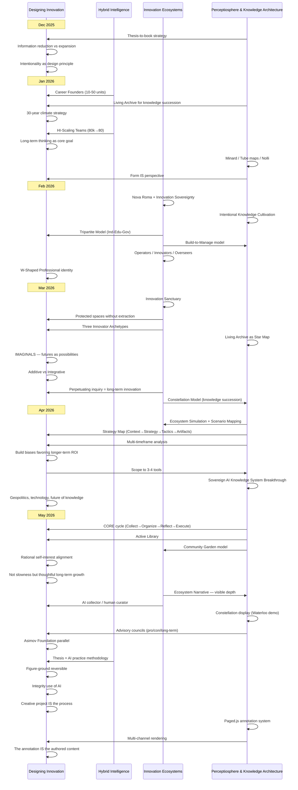

import MarginNote from '@/components/paged/MarginNote.astro';
import PageBreak from '@/components/paged/PageBreak.astro';

## Intellectual Development Timeline (December 2025 – May 2026)

Four concurrent threads of research and practice, tracked chronologically.

**Threads:**
1. **Hybrid Intelligence & AI-Native Organizations** — How small teams + AI agents scale to enterprise output
2. **Innovation Ecosystem Design** — Tripartite models, sanctuaries, archetypes, sovereignty
3. **Perceptiosphere & Knowledge Architecture** — CORE cycle, Active Library, visual tools, sovereign/collective knowledge
4. **Designing Innovation (Meta-Thread)** — The overarching evolution of long-term and sustainable innovation thinking

---

### Timeline Table

| Date | Designing Innovation (Meta) | Hybrid Intelligence | Innovation Ecosystems | Perceptiosphere & Knowledge Architecture |
|------|---------------------------|--------------------|-----------------------|------------------------------------------|
| Dec 21 | | | | Thesis-to-book strategy |
| Dec 28 | Information reduction vs. expansion; Intentionality as design principle | | | |
| Jan 15 | 30-year climate strategy; "Knowledge walks out the door" | Career Founders (10-50 person units) | | Living Archive for knowledge succession |
| Jan 20 | "Squirrel" focus; Long-term thinking as core goal | HI-Scaling Teams: 80,000→80 people | | |
| Jan 23 | | | | Minard, Tube maps, Nolli; "Form IS perspective"; Force-directed layouts; Bubble diagrams |
| Feb 2 | | | Nova Roma + Innovation Sovereignty | |
| Feb 3 | | | | Intentional Knowledge Cultivation |
| Feb 17 | | | Tripartite Model (Industry-Education-Government); Nova Roma as accretion disk; Operators / Innovators / Overseers | Build-to-Manage model |
| Feb 28 | W-Shaped Professional identity | | | |
| Mar 5 | | | AI-Enabled Innovation Ecosystem Strategy | |
| Mar 9 | Protected spaces for innovation without extraction | | Innovation Sanctuary; High-Skill Gig; Key-Shaped Talent | |
| Mar 14 | | | Comprehensive Innovation Ecosystem Framework | |
| Mar 20 | IMAGINALS; Additive vs. Integrative; "Perpetuating inquiry" as core of long-term innovation | | Three Innovator Archetypes (Vanguard / Scaler / Integrator) | Living Archive as "Star Map" |
| Mar 20 | Sovereign compute; Knowledge succession infrastructure | | Constellation Model (AI-enhanced PE) | |
| Mar 22 | | | AI-Driven Ecosystem — Canada national scale | |
| Apr 10 | | | | Ecosystem Simulation; Scenario Mapping |
| Apr 14 | Geopolitics, technology, future of knowledge | | | |
| Apr 17 | "Build biases favoring longer-term ROI"; Scope to 3-4 tools | | | Strategy Map (Context → Strategy → Tactics → Artifacts); Multi-timeframe analysis; Living Business Model Canvas |
| Apr 28 | | | | Sovereign AI Knowledge System Breakthrough |
| May 8 | "Not slowness but thoughtful, long-term growth" | | | CORE cycle; Active Library; Community Garden; Rational self-interest; Sovereign vs. Collective |
| May 11 | Visible depth over comprehensive breadth | | Ecosystem Narrative; AI collector / human curator; Anthology vs. Compendium | |
| May 15 | Asimov's Foundation parallel; Information-to-action pathway | | | Constellation display; Interactive requirements panel; Perceptiosphere demo (Waterloo); Advisory councils |
| May 22 | Figure-ground reversible; Integrity use of AI; Creative project IS the process | Thesis = AI practice methodology | | |
| May 29 | One authored source, multiple renderings; "The annotation IS the authored content" | | | Paged.js annotation system; Multi-channel rendering |

---

### Swimlane Diagram

---

### Thread Convergence (May 2026)

All four threads converge in May into a unified system:

| Thread | Converges Into |
|--------|---------------|
| Hybrid Intelligence | The Perceptiosphere's agent fleet (COS, Librarian, Researcher, Reflector) IS hybrid intelligence in practice |
| Innovation Ecosystems | The Community Garden model + Sovereign/Collective mesh IS the ecosystem architecture |
| Perceptiosphere & Knowledge Architecture | The CORE cycle, Active Library, strategy maps, constellation displays, and Paged.js annotation system ARE the operational and rendering layer |
| Designing Innovation | "The creative project IS the collaborative process" — the practice demonstrates the thesis |
