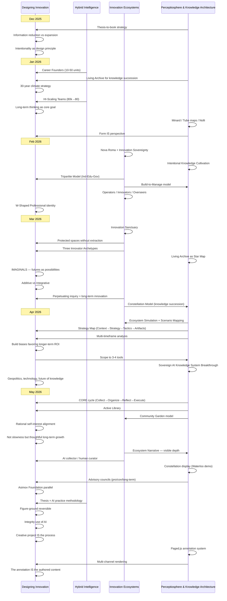

import MarginNote from '@/components/paged/MarginNote.astro';
import PageBreak from '@/components/paged/PageBreak.astro';

## Intellectual Development Timeline (December 2025 – May 2026)

Four concurrent threads of research and practice, tracked chronologically.

**Threads:**
1. **Hybrid Intelligence & AI-Native Organizations** — How small teams + AI agents scale to enterprise output
2. **Innovation Ecosystem Design** — Tripartite models, sanctuaries, archetypes, sovereignty
3. **Perceptiosphere & Knowledge Architecture** — CORE cycle, Active Library, visual tools, sovereign/collective knowledge
4. **Designing Innovation (Meta-Thread)** — The overarching evolution of long-term and sustainable innovation thinking

---

### Timeline Table

| Date | Designing Innovation (Meta) | Hybrid Intelligence | Innovation Ecosystems | Perceptiosphere & Knowledge Architecture |
|------|---------------------------|--------------------|-----------------------|------------------------------------------|
| Dec 21 | | | | Thesis-to-book strategy |
| Dec 28 | Information reduction vs. expansion; Intentionality as design principle | | | |
| Jan 15 | 30-year climate strategy; "Knowledge walks out the door" | Career Founders (10-50 person units) | | Living Archive for knowledge succession |
| Jan 20 | "Squirrel" focus; Long-term thinking as core goal | HI-Scaling Teams: 80,000→80 people | | |
| Jan 23 | | | | Minard, Tube maps, Nolli; "Form IS perspective"; Force-directed layouts; Bubble diagrams |
| Feb 2 | | | Nova Roma + Innovation Sovereignty | |
| Feb 3 | | | | Intentional Knowledge Cultivation |
| Feb 17 | | | Tripartite Model (Industry-Education-Government); Nova Roma as accretion disk; Operators / Innovators / Overseers | Build-to-Manage model |
| Feb 28 | W-Shaped Professional identity | | | |
| Mar 5 | | | AI-Enabled Innovation Ecosystem Strategy | |
| Mar 9 | Protected spaces for innovation without extraction | | Innovation Sanctuary; High-Skill Gig; Key-Shaped Talent | |
| Mar 14 | | | Comprehensive Innovation Ecosystem Framework | |
| Mar 20 | IMAGINALS; Additive vs. Integrative; "Perpetuating inquiry" as core of long-term innovation | | Three Innovator Archetypes (Vanguard / Scaler / Integrator) | Living Archive as "Star Map" |
| Mar 20 | Sovereign compute; Knowledge succession infrastructure | | Constellation Model (AI-enhanced PE) | |
| Mar 22 | | | AI-Driven Ecosystem — Canada national scale | |
| Apr 10 | | | | Ecosystem Simulation; Scenario Mapping |
| Apr 14 | Geopolitics, technology, future of knowledge | | | |
| Apr 17 | "Build biases favoring longer-term ROI"; Scope to 3-4 tools | | | Strategy Map (Context → Strategy → Tactics → Artifacts); Multi-timeframe analysis; Living Business Model Canvas |
| Apr 28 | | | | Sovereign AI Knowledge System Breakthrough |
| May 8 | "Not slowness but thoughtful, long-term growth" | | | CORE cycle; Active Library; Community Garden; Rational self-interest; Sovereign vs. Collective |
| May 11 | Visible depth over comprehensive breadth | | Ecosystem Narrative; AI collector / human curator; Anthology vs. Compendium | |
| May 15 | Asimov's Foundation parallel; Information-to-action pathway | | | Constellation display; Interactive requirements panel; Perceptiosphere demo (Waterloo); Advisory councils |
| May 22 | Figure-ground reversible; Integrity use of AI; Creative project IS the process | Thesis = AI practice methodology | | |
| May 29 | One authored source, multiple renderings; "The annotation IS the authored content" | | | Paged.js annotation system; Multi-channel rendering |

---

### Swimlane Diagram

---

### Thread Convergence (May–June 2026)

All four threads converge into a unified method: aligning individual practices, startups, companies, and efforts of various people — and composing them to build a collective context for long-term innovation.

| Thread | Converges Into |
|--------|---------------|
| Hybrid Intelligence | The operational layer — agentic workflows with human-AI teams that benefit from curated, collectively-managed knowledge. AI enables greater throughput in the Perceptiosphere's management. |
| Innovation Ecosystems | Sovereign knowledge contexts (individual or corporate) composed into strategic coalitions via collective layers. The Community Garden model governs voluntary contribution and equitable access. |
| Perceptiosphere & Knowledge Architecture | The foundational knowledge mapping required for all intelligent systems to operate — people or AI. CORE cycle, Active Library, constellation displays, and annotation system form the infrastructure. |
| Designing Innovation | Evolves from "Designing Innovation" → "Cultivating and Contributing to a Long-Term Innovation Community." A blueprint for building collaborations of long-term thinkers. |

---

## The Gestalt: Why the Whole Exceeds Its Parts

The convergence of these four threads is not merely additive. It is emergent.

Gestalt psychology's central insight — that the whole possesses properties none of its parts alone can explain — provides the framework for understanding what this six-month scoping exercise produced. The individual projects (Perceptiosphere, Constellation, Sovereign AI scenarios, dynamic business tools) are outputs of professional development. Their collective application and synergy to form a holistic approach to long-term innovation is the contribution.

This distinction matters. Systems thinking would decompose these threads into dependencies and hierarchies. Interdisciplinarity would note their overlap. But Gestalt demands something more: the recognition that the *framework itself* — the method of composing sovereign knowledge contexts into collaborative wholes — is a novel emergent property that exists only when all threads interact.

### Nested Wholes

The framework operates through nested Gestalts, each level containing and depending upon the levels within it:

- **Micro-Gestalt: Human-AI Partnership.** Neither human nor AI alone can sustain the throughput and curation quality required for long-term knowledge work. Together, they form a reified unit — a partnership with its own capabilities, its own contour, its own emergent properties. The human provides intent, judgment, and sovereignty. The AI provides pattern recognition, retrieval, and scale. The partnership produces what neither could alone.

- **Meso-Gestalt: The Perceptiosphere System.** Knowledge architecture + agent fleet + sovereign/collective composition model. This is not a tool. It is an operating environment within which knowledge work occurs. Its emergent property: foundational knowledge mapping that makes all intelligent systems (human or AI) more effective.

- **Macro-Gestalt: The Long-Term Innovation Community.** Composed of all tools, artifacts, people, and collaborative processes. Individuals maintain sovereign knowledge contexts. They choose what to compose into collectives. The collective produces insight, alignment, and capacity for multi-generational inquiry that no individual could sustain alone.

Each addition to the system — a new collaborator, a new tool, a new artifact — reconfigures the emergent properties of the whole. The framework is not static. It is a living Gestalt that evolves as its parts evolve.

### The Temporal Dimension

Gestalts are process-oriented: born, evolved, and continuously reconfigured. This thesis captures the whole at a specific point in time — June 2026 — acknowledging its continuous development. The appropriate question for the review panel is not "What is the creative project?" but rather: *"What is the appropriate stopping point or scope for this DDes?"*

The answer proposed: the thesis is the articulation of the evolving whole at this moment. The companion artifacts are the parts that compose it. Together, they demonstrate how a holistic framework for long-term innovation emerges from the deliberate composition of diverse research threads, tools, and collaborative practices.

---

## Reflective Essay: From Designing Innovation to Cultivating Community

### The Starting Position (December 2025)

In December 2025, I arrived at my Winter Symposium having reframed my doctoral research from "Foresight-Driven Innovation" to "Designing Innovation: A Framework for Cultivating Innovation for Greater Societal Resilience." The presentation introduced a five-component hub blueprint (People, Playbook, Mindset, Fuel, Place), a "Cat's Cradle" framework mapping the tensions between future pull, present push, and the weight of the past, and societal resilience as the animating purpose of the work.

What followed was not a linear deepening of that framework. It was an explosion outward — a deliberate, disciplined scoping exercise across four concurrent threads of practice and research. Each thread developed its own momentum, its own vocabulary, its own community of collaborators. And each thread, in ways I could not have predicted, began to converge.

### Thread 1: Hybrid Intelligence — What Scale Actually Means

The first thread began with a provocation from Larry Smith in January: "Knowledge walks out the door." His observation about knowledge succession in entrepreneurial ecosystems led me to examine how small teams with AI agents achieve outputs that previously required hundreds of people. The concept of "Career Founders" — serial innovators operating in teams of 10 to 50 — emerged as a pattern. Barry Wylant pushed this further: if a team of 80 can do what 80,000 once did, what are the implications for how we design innovation infrastructure?

This thread matured into a specific operational question: how do you design agentic workflows where human-AI teams collaborate on knowledge-intensive work? The answer is not merely technological. It requires a curated knowledge base — a shared substrate that both humans and AI systems can reference, query, and build upon. Hybrid intelligence, in this framing, is not the Perceptiosphere itself. It is what becomes possible when the foundational knowledge mapping is in place.

### Thread 2: Innovation Ecosystems — From Extraction to Cultivation

The second thread developed through intensive collaboration with James Cheng and the broader Waterloo ecosystem. In February, the Tripartite Model emerged — industry, education, and government as three pillars of innovation, with Nova Roma positioned as an "accretion disk" drawing disparate efforts into alignment. By March, this had evolved into the Innovation Sanctuary concept: protected spaces for innovation without extraction, where Key-Shaped Talent (deep expertise with broad adaptability) could develop over career-length timescales.

The critical insight arrived in March when Barry articulated long-term innovation as "perpetuating inquiry" — not solving problems but continuously identifying and refining the questions worth asking. This reframed the entire ecosystem thread: the purpose of an innovation ecosystem is not to produce innovations (that is a side effect). Its purpose is to sustain communities of practice that can ask better questions across generational timescales.

Three Innovator Archetypes crystallized: Vanguards (who push boundaries), Scalers (who bring innovations to market), and Integrators (who weave innovations into societal fabric). Each archetype requires different support structures, different time horizons, and different relationships to collective knowledge.

### Thread 3: Perceptiosphere — Foundational Knowledge Mapping

The third thread — the most technically demanding — began with an observation about the inadequacy of existing knowledge management tools. Neither personal tools (Obsidian, Notion) nor institutional tools (SharePoint, Confluence) bridge the gap between individual sense-making and collective intelligence. What's needed is foundational knowledge mapping: a substrate upon which all intelligent systems — human or AI — can operate.

The Perceptiosphere framework implements a CORE cycle: Collect raw information from diverse sources; Organize it into semantic atoms via AI agents; Reflect on patterns through human curation; Execute by producing new outputs that feed back into the cycle. The architecture introduces concentric sovereignty: individuals maintain complete control over their knowledge context and choose what to compose into collective layers. No mandated contribution. No surveillance. Voluntary curation, rewarded by the quality of the collective resource.

By May, this framework was operational — managing my own research practice with a fleet of AI agents (Chief of Staff, Librarian, Researcher, Reflector) that process meeting notes, research materials, and reflections into an evolving knowledge mesh. The constellation display tool visualizes these relationships as navigable star maps. The annotation system renders the same content across print, web, and slide formats.

When applied to innovation ecosystems, this architecture enables any combination of sovereign knowledge contexts — individual, corporate, or institutional — to form strategic coalitions through composable collective layers. Indigenous communities can curate their own knowledge and choose precisely who they share it with, and under what terms. Academic departments can surface their dormant theses and symposium papers for active curation. Startup ecosystems can build shared intelligence without surrendering competitive advantage.

### Thread 4: The Meta-Evolution — From Tools to Community

The fourth thread is the meta-narrative itself: how the research question evolved from "How do we design innovation?" to "How do we cultivate and contribute to a long-term innovation community?"

In January, the framing was tool-centric: build a foresight tool, build a culture hub, build a market transition mechanism. By March, it had shifted to community-centric: create protected spaces, define archetypes, align incentives for long-term collaboration. By May, it became process-centric: the method of aligning individual practices into composed collective contexts IS the innovation — not the artifacts that emerge from it.

Barry captured this shift as a "figure-ground reversible": you can emphasize either the topic (long-term innovation) or the tool (the AI-augmented knowledge system), and both perspectives are valid. The topic requires the tool to be tractable at scale. The tool requires the topic to be worth building for.

The evolution from December to June can be stated simply:

> **December 2025:** "How do we design innovation for societal resilience?"  
> **June 2026:** "How do we cultivate communities that perpetuate inquiry across generations — and what tools, blueprints, and artifacts does that practice produce?"

---

## The Problems This Scoping Exercise Validates

Six months of parallel exploration, with over 45 active projects touching 13 startups and 84 collaborators, validated two fundamental problems:

### Problem 1: Knowledge Wastage and Redundant Discovery

Communities of practice suffer from systematic knowledge wastage. Efforts are necessarily rediscovered and researched repeatedly. People make the same mistakes without the opportunity to encounter previous contexts — even when they belong to the same community. This manifests in multiple forms:

- **Knowledge succession:** When Wayne retired from Conrad Business School, his intellectual network — 1,000+ students, 700+ documented ventures, decades of design thinking methodology — became invisible. Not lost, but inaccessible. A super-connector with an abnormal volume of high-quality connections, now gone. Students cannot encounter each other's work, previous contexts, or the intellectual lineage that connects them.
- **Dormant scholarship:** Symposiums and doctoral theses sit with full open public access but are rarely curated by the communities they serve. The knowledge exists. No one encounters it.
- **Institutional amnesia:** Every generation of innovators in an ecosystem must rebuild context from scratch — the same failures researched, the same patterns rediscovered, the same relationships re-established.

### Problem 2: Short-Termism Undermines Societal Resilience

Short-termism actively encourages innovation practices that undermine societal resilience. People lack the tools — or have no incentive to use the tools — to see the long-term impact of their decisions. The popular business tools of our era (Business Model Canvas, SWOT analysis, lean startup methodology) are static snapshots. They cannot hold temporal complexity. They cannot represent a portfolio of futures.

This motivates two categories of intervention:

- **Incremental innovation:** Making existing, popular business tools more dynamic by injecting the dimension of time. A Business Model Canvas evaluated not just for today, but across a range of scenarios over 10, 30, 50 years.
- **Disruptive innovation:** Expanding the concern horizon of these tools by injecting not only linear time, but a portfolio of scenarios and possibilities that can be explored. This increases the ambition of what a "business tool" can be — from decision-support to futures-navigation.

### External Validation: Cooperathon 2026

Three projects from this research practice advanced to Cooperathon 2026 Phase 2 (selected from 200+ submissions, fewer than 50 teams proceeding):

1. **Perceptiosphere** (University Research Track) — The knowledge management system itself, demonstrating CORE cycle and sovereign/collective architecture.
2. **Sovereign Distributed Energy and AI for Canada** (Prosperity Track) — A 50-year foresight scenario exploring Canadian energy sovereignty, serving as a testbed for the long-term thinking tools developed in this practice.
3. **Climate Action Knowledge Map** (Planet Track) — An application of the Perceptiosphere in capturing regenerative and climate action practices, demonstrating equitable knowledge access through community-sovereign curation. Indigenous knowledge curated by its owners, composed into collectives by choice.

---

## Demonstrations: Addressing the Validated Problems

### Demo 1: The Constellation — Addressing Knowledge Wastage

When Wayne departed Conrad Business School, his intellectual network — 1,000+ students, 700+ documented ventures during his tenure — risked becoming invisible. Not destroyed, but inaccessible. The connective tissue that linked generations of student entrepreneurs, that revealed patterns across cohorts, that enabled serendipitous discovery of related work — all of it went dark.

The Constellation is a knowledge succession tool developed in collaboration with the University of Waterloo. It visualizes intellectual ecosystems as navigable star maps: nodes representing people, ventures, concepts, and projects; edges representing relationships, collaborations, and influences; and a temporal dimension showing how ideas evolved across cohorts and decades.

The critical design principle: community-sovereign curation. Members of this constellation — Wayne's former students, collaborators, mentees — can encounter each other's work, build upon previous contexts, and contribute to the collective map. The knowledge is not extracted from them. They choose what to share and with whom.

This addresses the knowledge wastage problem directly: by making previous contexts discoverable, the constellation reduces redundant discovery. It does not eliminate the need for original work. It ensures that original work can stand on the shoulders of what came before rather than unknowingly repeating it.

### Demo 2: Foresight Scenario Exploration — Addressing Short-Termism

Canada holds 0.6% of global AI supercomputing capacity. 53% of Canadian AI professionals have relocated to U.S. firms. AI startup funding fell 30% between 2023 and 2024. 42% of Canadian AI patents are U.S.-owned. Without sovereign compute infrastructure, every AI workload routes through foreign cloud systems — creating dependency, data sovereignty risks, and economic leakage.

The problem is not a lack of talent. It is a lack of capital infrastructure and a lack of tools that help decision-makers think at the timescale of the problem. Energy infrastructure decisions made today have consequences over 30-50 year horizons. No one is building tools that operate at that timescale.

This demo explores a 50-year Canadian energy sovereignty scenario (2025–2075) using alternative histories, speculative futures, and multi-model AI deliberation on scenario branches. The tool enables stakeholders to navigate branching possibilities — not to predict the future, but to expand the range of futures they consider when making today's decisions. Real research scenarios are in development for the July Cooperathon pitch; the symposium demonstrates the conceptual architecture with sample data.

### Demo 3: Dynamic Business Tools — From Static to Temporal

Existing business tools are static. A Business Model Canvas captures a single moment. A SWOT analysis freezes strengths, weaknesses, opportunities, and threats at a point in time. But the world moves. Decisions made using static tools accumulate consequences that only become visible over longer horizons.

This demo takes the foresight scenarios from Demo 2 and applies them to familiar business tools: a Business Model Canvas evaluated against multiple futures; a SWOT analysis that evolves as scenarios unfold; strategy maps that connect today's decisions to 10-year and 30-year consequences.

The intervention is twofold:
- **Incremental:** popular, widely-adopted tools made dynamic through temporal injection.
- **Disruptive:** the concern horizon of these tools expanded by embedding scenario portfolios that change the questions being asked.

The Sovereign AI Cooperathon project serves as a living testbed for these long-term thinking tools — tools developed as part of this "cultivating a long-term innovation community" practice.

---

## Next Steps: The Creative Project

This research proceeds along three layers of increasing complexity:

**Layer 1 — The Operating System / Blueprint:**
How to formulate information to then create innovations. The Perceptiosphere architecture and community composition model provide the foundational substrate upon which all other layers depend.

**Layer 2 — The Innovations / Tools:**
Created from this blueprint to encourage long-term thinking. Temporal business tools, scenario navigation systems, constellation displays, and the annotation system that renders a single authored source across print, web, and slide formats.

**Layer 3 — The Artifacts / Outputs:**
Created with these tools that demonstrate long-term thinking or encourage cross-generational collaboration. Cooperathon submissions, community knowledge maps, published essays, and this very document.

### Proposed Creative Project Direction

The development of this research project — the story anthology of how it evolved — is proposed as the research thesis in the DDes. The thesis commentates and annotates the set of tools and volume of information it has helped create and collect: a thesis with a companion-published book and various digital artifacts, documented via the annotation system in both print and web formats. Each artifact or output can be revisited with meta-commentary on how it was advised within the research process.

This is one possible direction. Alternatives include:
- The tools and artifacts alone as the creative project
- The curated collective knowledge itself as the creative project
- The collaborative process of building the community as the creative project

The supervisory committee's perspective on which framing — or combination — best serves the contribution is welcomed and will be discussed in fall 2026.
